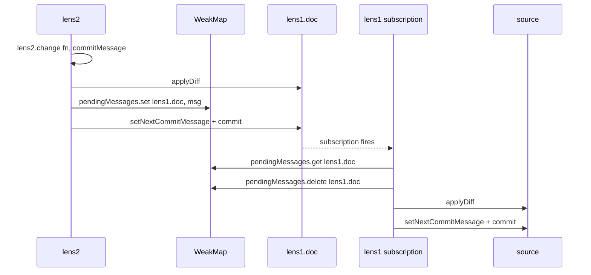
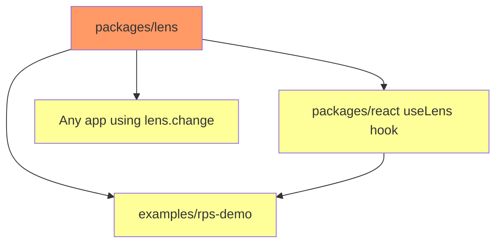

# Lens Commit Message Propagation

## Background

The lens architecture provides bidirectional filtered synchronization between a "world" (shared, converging document) and a "worldview" (filtered perspective). Changes flow:

- **World → Worldview**: Commit-level filtered import
- **Worldview → World**: State-based `applyDiff` + `commit`

Two internal functions handle worldview→world propagation:

- [`processLocalChange()`](packages/lens/src/lens.ts:383) - handles `lens.change()` calls
- [`processWorldviewChange()`](packages/lens/src/lens.ts:337) - handles chained-lens propagation

## Problem Statement

**Commit messages set on the worldview are NOT propagated to the world.**

When a developer calls:

```typescript
loro(lens.doc).doc.setNextCommitMessage(createIdentityMessage(playerId));
lens.change((d) => {
  /* ... */
});
```

The message is consumed by the worldview's internal commit but never reaches the world. Server-side filters that rely on `CommitInfo.message` receive `undefined`, breaking identity-based filtering.

**Verified by failing test:**

```
FAIL  src/lens.test.ts > createLens > local changes via change() > propagates commit messages from worldview to world
AssertionError: expected undefined to be 'client-identity-message'
```

### Root Cause: Two-Commit Problem

[`processLocalChange()`](packages/lens/src/lens.ts:383) creates two separate commits:

1. **Commit #1 on worldview**: `applyChange(doc, fn)` internally calls `this.doc.commit()` - message consumed here
2. **Commit #2 on world**: `sourceLoroDoc.commit()` at [line 409](packages/lens/src/lens.ts:409) - no message set

The `applyDiff()` method transfers state changes only, not commit metadata.

## Success Criteria

1. ✅ Test "propagates commit messages from worldview to world" passes
2. ✅ `lens.change(fn, { commitMessage })` API available and documented
3. ✅ Chained lenses propagate commit messages through the chain
4. ✅ RPS demo works with identity-based filtering
5. ✅ Existing tests continue to pass (35/35 lens tests, 149/149 hooks-core tests, 15/15 react tests, 5/5 rps-demo tests)

## Gap Analysis

| Current State                           | Desired State                           |
| --------------------------------------- | --------------------------------------- |
| `lens.change(fn)` - no message option   | `lens.change(fn, { commitMessage? })`   |
| Message set on worldview, lost on world | Message set on world before commit      |
| Two separate propagation functions      | Unified `propagateToWorld()` function   |
| Chained lens messages lost              | Messages flow through chain via WeakMap |

## Solution Design

### Unified Propagation with WeakMap

Instead of extracting commit messages from frontiers (expensive), use a module-level WeakMap for O(1) message passing between lens levels.

**Why WeakMap is safe**: Loro subscriptions fire **synchronously** during `commit()`. JavaScript is single-threaded, so each `lens.change()` call completes fully (including all subscription callbacks up the chain) before the next one starts. The WeakMap entry is set before `commit()` and retrieved/deleted during the synchronous subscription callback.

```typescript
// Module-level WeakMap for inter-lens message passing
const pendingMessages = new WeakMap<LoroDoc, string>();

// Unified propagation function
function propagateToWorld(commitMessage?: string): void {
  const worldviewFrontiersAfter = docLoroDoc.frontiers();
  if (frontiersEqual(lastKnownDocFrontiers, worldviewFrontiersAfter)) return;

  const diff = docLoroDoc.diff(
    lastKnownDocFrontiers,
    worldviewFrontiersAfter,
    false,
  );
  sourceLoroDoc.applyDiff(diff);

  if (commitMessage) {
    sourceLoroDoc.setNextCommitMessage(commitMessage);
    // Store for parent lens to pick up
    pendingMessages.set(sourceLoroDoc, commitMessage);
  }
  sourceLoroDoc.commit();
  syncFrontiers();
}
```

### How It Works



### Unified Code Paths

Both `processLocalChange()` and the worldview subscription use the same `propagateToWorld()`:

```typescript
// processLocalChange becomes a thin wrapper
function processLocalChange(fn, options?: ChangeOptions): void {
  const serializedMessage = serializeMessage(options?.commitMessage);
  applyChange(doc, fn); // Apply to worldview
  propagateToWorld(serializedMessage);
}

// Worldview subscription retrieves pending message
const unsubscribeWorldview = docLoroDoc.subscribe((event) => {
  if (event.by === "local") {
    const pendingMessage = pendingMessages.get(docLoroDoc);
    pendingMessages.delete(docLoroDoc);
    propagateToWorld(pendingMessage);
  }
});
```

## Phases and Tasks

### Phase 1: Unified Propagation Function ✅

- ✅ **1.1** Add module-level `pendingMessages` WeakMap to [`lens.ts`](packages/lens/src/lens.ts)
- ✅ **1.2** Create unified `propagateToWorld(commitMessage?)` function
- ✅ **1.3** Add `serializeMessage()` helper for string/object handling with try-catch for JSON.stringify errors (circular refs, BigInt, etc.)

### Phase 2: API and Integration ✅

- ✅ **2.1** Add `ChangeOptions` interface to [`types.ts`](packages/lens/src/types.ts)
- ✅ **2.2** Update `Lens.change()` signature in [`types.ts`](packages/lens/src/types.ts:168)
- ✅ **2.3** Refactor `processLocalChange()` to use `propagateToWorld()`
- ✅ **2.4** Update worldview subscription to retrieve pending message and call `propagateToWorld()`
- ✅ **2.5** Remove now-redundant `processWorldviewChange()` function

### Phase 3: Tests ✅

- ✅ **3.1** Fix existing failing test "propagates commit messages from worldview to world"
- ✅ **3.2** Add test for object commit messages (auto-JSON serialization)
- ✅ **3.3** Add test for chained lens commit message propagation
- ✅ **3.4** Add test for three-level chain commit message propagation

### Phase 4: Documentation & Cleanup ✅

- ✅ **4.1** Update JSDoc for `lens.change()` in [`types.ts`](packages/lens/src/types.ts:150)
- ✅ **4.2** Update [`packages/lens/README.md`](packages/lens/README.md) with commit message examples
- ✅ **4.3** Update RPS demo to use new API in [`use-rps-game.ts`](examples/rps-demo/src/client/use-rps-game.ts)
- ✅ **4.4** Create changeset for the lens package

## Transitive Effect Analysis



| Affected Module        | Impact                                  | Action Required                   |
| ---------------------- | --------------------------------------- | --------------------------------- |
| `@loro-extended/lens`  | Direct - API change                     | Implement new signature           |
| `@loro-extended/react` | Indirect - `useLens` returns lens       | No change needed (pass-through)   |
| `examples/rps-demo`    | Consumer - uses `lens.change()`         | Update to use new API             |
| External consumers     | Breaking if relying on current behavior | Changeset with minor version bump |

**Note**: The change is **additive** - existing `lens.change(fn)` calls continue to work. The `options` parameter is optional.

## Test Strategy

Reuse existing test patterns from [`lens.test.ts`](packages/lens/src/lens.test.ts):

```typescript
// Test 1: Basic commit message propagation (fix existing)
it("propagates commit messages from worldview to world", () => {
  const lens = createLens(source);
  lens.change((d) => d.counter.increment(1), { commitMessage: "test-message" });
  // Verify message on source
});

// Test 2: Object message serialization
it("serializes object commit messages to JSON", () => {
  lens.change((d) => d.counter.increment(1), {
    commitMessage: { playerId: "alice" },
  });
  // Verify JSON.stringify'd message on source
});

// Test 3: Chained lens propagation
it("propagates commit messages through chained lenses", () => {
  const lens1 = createLens(source);
  const lens2 = createLens(lens1.doc);
  lens2.change((d) => d.counter.increment(1), {
    commitMessage: "chained-message",
  });
  // Verify message reaches source (world)
});
```

## Changeset

```markdown
---
"@loro-extended/lens": minor
---

Add `commitMessage` option to `lens.change()` for identity-based filtering

- `lens.change(fn, { commitMessage })` now propagates the message to the world commit
- Object messages are automatically JSON-serialized
- Chained lenses propagate commit messages through the chain
- Fixes identity-based filtering in applications like the RPS demo
```

## Documentation Updates

### README.md Addition

```markdown
### Commit Messages

When using lens-based filtering, you can attach commit messages that will be visible to server-side filters:

\`\`\`typescript
lens.change(draft => {
draft.game.players.get(playerId).choice = "rock"
}, { commitMessage: { playerId } })
\`\`\`

The message is automatically JSON-serialized and available in the filter's `CommitInfo.message`.
```
