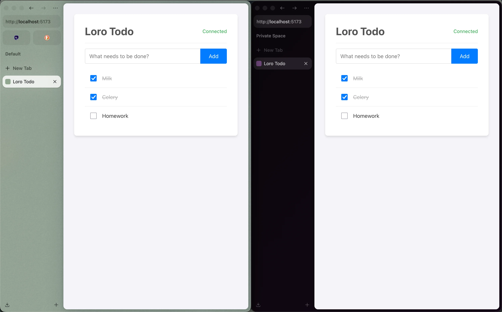
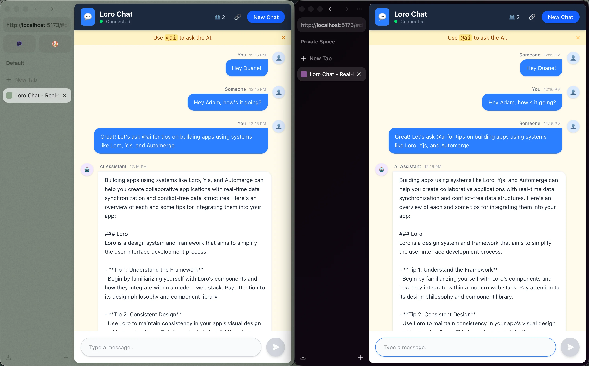
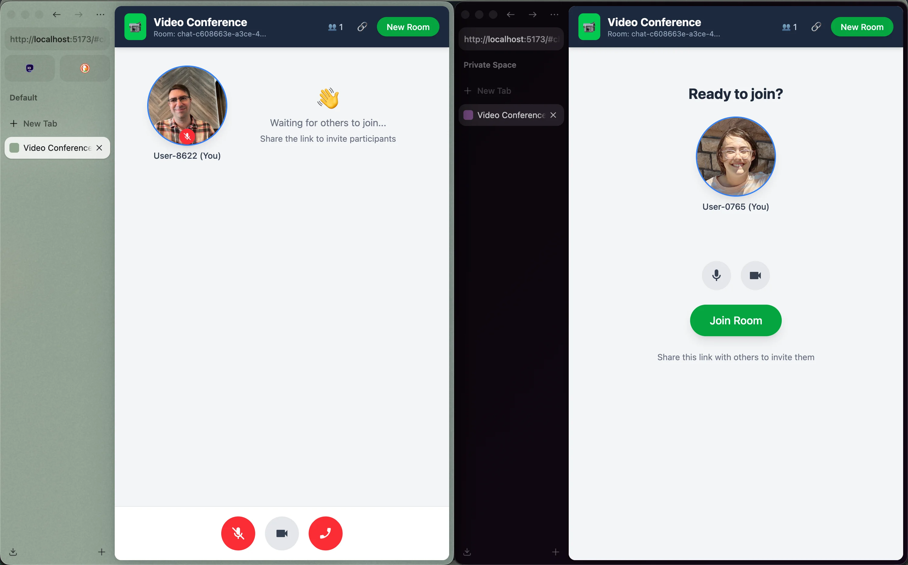
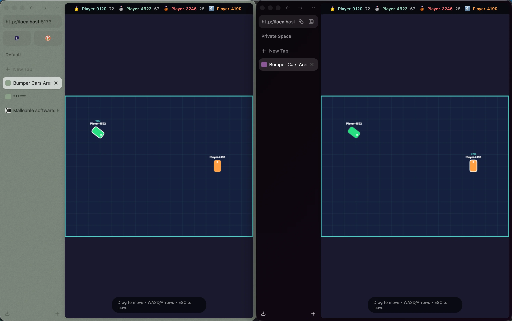
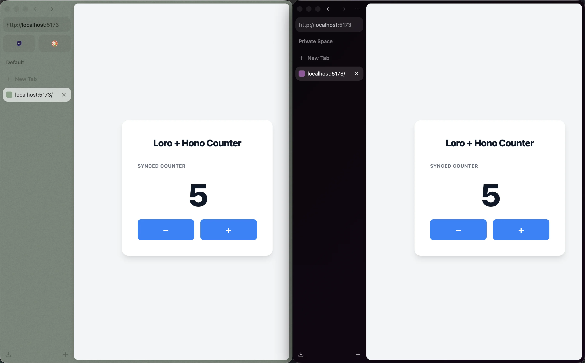

# Loro Extended

**A toolkit for building local-first applications and multi-agent systems with [Loro](https://github.com/loro-dev/loro).**

`@loro-extended` adds a pleasant layer of abstraction--schemas, network synchronization, persistence, and reactivity--to a raw CRDT engine called Loro. It's built to make it easy to focus on distributed application logic, instead of the usual shuttling of state between peers, clients, agents, etc. in a distributed system.

---

## 📚 Examples

Explore these example applications to see `@loro-extended` in action:

<table>
<tr>
<td width="50%">

### [Todo App](./examples/todo-sse)

Real-time collaborative todo list with React and SSE. Demonstrates offline-first architecture with automatic conflict resolution.



</td>
<td width="50%">

### [Chat with AI](./examples/chat)

Collaborative chat with AI streaming. Features reactive server-side AI responses that stream directly into Loro Text containers.



</td>
</tr>
<tr>
<td width="50%">

### [Video Conference](./examples/video-conference)

WebRTC-based video conferencing with peer-to-peer sync. Demonstrates dual-adapter architecture (SSE + WebRTC) for resilient, low-latency collaboration.



</td>
<td width="50%">

### [Bumper Cars](./examples/bumper-cars)

Multiplayer bumper cars arena with server-authoritative physics. Demonstrates presence system for real-time game state and CRDT counters for persistent scoring.



</td>
</tr>
<tr>
<td width="50%">

### [Hono Counter](./examples/hono-counter)

A simple counter app using Hono's jsx-dom with Vite. Shows how to integrate `@loro-extended/hono` with the Hono framework.



</td>
<td width="50%">

</td>
</tr>
</table>

**Additional Examples:**

| Example                                           | Description                                                                                                  |
| :------------------------------------------------ | :----------------------------------------------------------------------------------------------------------- |
| **[`todo-websocket`](./examples/todo-websocket)** | Same as `todo`, but uses WebSocket instead of SSE for real-time communication.                               |
| **[`postgres`](./examples/postgres)**             | Demonstrates PostgreSQL storage adapter usage. Shows how to persist Loro documents to a PostgreSQL database. |

---

## The "Zero-Plumbing" Philosophy

Whether you are building a web app or a group of cooperating AI agents, managing state synchronization is often the hardest part. You spend half your time writing "plumbing": API endpoints, WebSocket handlers, retry logic, and conflict resolution.

**We think there's a better way.**

Instead of treating state as something you _fetch_ and _save_, treat it as something you _have_. You mutate local data, and the system handles the rest—persisting it, syncing it, and merging it.

---

## Use Case 1: Modern Web Development

For web developers, `@loro-extended` offers a "Local-First" architecture that simplifies your stack while improving user experience.

### The Problem: API Fatigue

In a traditional app, a simple "Add Todo" feature requires:

1.  Optimistic UI update code.
2.  A `POST /api/todos` endpoint.
3.  Database schema and migration.
4.  WebSocket logic to broadcast the change.
5.  Client-side logic to merge incoming updates.

### The Solution: Mutation Sync

With `@loro-extended`, the process is:

1.  **You write:** `doc.todos.push(newTodo)`
2.  **Done.**

The library (optionally) persists the change to IndexedDB for offline support, queues it, and syncs it with peers or servers automatically. You get:

- **Real-time Collaboration:** Multiplayer is default, not a feature add-on.
- **Offline Capability:** Apps work perfectly without internet and sync when back online.
- **Instant Load:** No loading spinners; data is available immediately from local storage.

---

## Use Case 2: Agentic Cooperation

For AI engineers, `@loro-extended` provides a shared memory substrate for multi-agent systems.

### The Problem: Context & Coordination

Agents often need "full context" to make good decisions--chat history, current world state, and user intent.

- **Stateless Agents** suffer from amnesia or require massive context windows re-sent with every request.
- **Database-Backed Agents** are slow, constantly polling or fetching state, leading to race conditions when multiple agents (or users) act simultaneously.

### The Solution: Shared CRDT Memory

By treating agents as "peers" in a CRDT network, you decouple **Execution** (the LLM) from **State** (the Memory).

- **Agents as Observers:** An agent can subscribe to a document. When a user (or another agent) changes the state, the agent is notified immediately with the precise delta.
- **Concurrent Action:** Multiple agents can work on the same task--one generating code, another fixing bugs, a third updating the UI--without locking the state or overwriting each other.
- **Resilience:** If an agent process crashes, the state is safe. Another agent can pick up exactly where it left off, because the state lives in the CRDT, not the agent's memory.

---

## Why Loro Extended?

### 1. Schema-First & Type-Safe

Raw CRDTs can feel like "schemaless JSON soup." We bring structure back. Define a `Shape`, and get full TypeScript inference for every mutation.

```typescript
import { createTypedDoc, Shape, batch } from "@loro-extended/change";

// Define your schema once
const schema = Shape.doc({
  todos: Shape.list(
    Shape.map({
      text: Shape.text(),
      done: Shape.plain.boolean(),
    })
  ),
});

const doc = createTypedDoc(schema);

// Get full intellisense and type checking
batch(doc, (draft) => {
  draft.todos.push({ text: "Buy milk", done: false }); // ✅ Type-safe
  draft.todos.push({ text: 123 }); // ❌ Error: Type 'number' is not assignable to 'string'
});
```

### 2. Instant Load (No Spinners)

With our **Empty State Overlay**, your app renders immediately with default values while the real data syncs in the background.

- **Before:** `if (!data) return <Spinner />`
- **After:** `return <div>{doc.title}</div>` (Renders "Untitled" immediately, then updates)

### 3. Performance

Built on [Loro](https://github.com/loro-dev/loro), which is written in Rust. It is incredibly fast at merging and calculating diffs, capable of handling large documents and long editing sessions that slow other libraries down. In addition, it supports [shallow snapshots and redaction](https://loro.dev/docs/concepts/shallow_snapshots), so you aren't tied to the entire document history forever.

---

## The Stack

This monorepo is a collection of packages designed to work together:

### Core Packages

| Package                                          | Description                                                                                                                                                                                                                                 |
| :----------------------------------------------- | :------------------------------------------------------------------------------------------------------------------------------------------------------------------------------------------------------------------------------------------ |
| **[`@loro-extended/change`](./packages/change)** | **The Data Layer.** A schema-driven wrapper for Loro. Provides the `change()` function and TypeScript magic.                                                                                                                                |
| **[`@loro-extended/repo`](./packages/repo)**     | **The Sync Engine.** Manages documents lifecycle, storage, and network sync. It's your local data store.                                                                                                                                    |
| **[`@loro-extended/react`](./packages/react)**   | **The UI Layer.** React hooks like `useDocument` and `usePresence` that bind your data to your views. See [`todo-sse`](./examples/todo-sse), [`chat`](./examples/chat), and [`video-conference`](./examples/video-conference) for examples. |
| **[`@loro-extended/hono`](./packages/hono)**     | **The UI Layer.** Hono JSX hooks and utilities, including `useDocument` and `usePresence`. See [`hono-counter`](./examples/hono-counter) for an example.                                                                                    |

### Storage Adapters

| Package                                                        | Description                                                                                           |
| :------------------------------------------------------------- | :---------------------------------------------------------------------------------------------------- |
| **[`@loro-extended/adapter-indexeddb`](./adapters/indexeddb)** | IndexedDB storage for browser-based persistence.                                                      |
| **[`@loro-extended/adapter-leveldb`](./adapters/leveldb)**     | LevelDB storage for server-side persistence.                                                          |
| **[`@loro-extended/adapter-postgres`](./adapters/postgres)**   | PostgreSQL storage for server-side persistence. See [`postgres`](./examples/postgres) for an example. |

### Network Adapters

| Package                                                              | Description                                                                                                                                  |
| :------------------------------------------------------------------- | :------------------------------------------------------------------------------------------------------------------------------------------- |
| **[`@loro-extended/adapter-http-polling`](./adapters/http-polling)** | HTTP polling network adapter with long-polling support. See [`examples/todo-sse/POLLING.md`](./examples/todo-sse/POLLING.md) for usage.      |
| **[`@loro-extended/adapter-sse`](./adapters/sse)**                   | Server-Sent Events (SSE) for real-time client-server sync. See [`todo-sse`](./examples/todo-sse) and [`chat`](./examples/chat) for examples. |
| **[`@loro-extended/adapter-websocket`](./adapters/websocket)**       | WebSocket adapter for real-time client-server sync. See [`todo-websocket`](./examples/todo-websocket) for a full example.                    |
| **[`@loro-extended/adapter-webrtc`](./adapters/webrtc)**             | WebRTC data channel adapter for peer-to-peer document synchronization. See [`video-conference`](./examples/video-conference) for an example. |

---

## 🚀 Quick Start

Here is a complete collaborative "Counter" app in React.

```tsx
import { useDocument, Shape } from "@loro-extended/react";

// 1. Define Schema (with placeholder defaults)
const counterSchema = Shape.doc({
  count: Shape.counter(),
  users: Shape.list(Shape.plain.string()),
});

function App() {
  // 2. Use the hook (Auto-syncs, Auto-persists)
  // Returns [value, changeDoc, handle] - value has placeholder defaults applied
  const [doc, changeDoc] = useDocument("global-counter", counterSchema);

  return (
    <div>
      <h1>Count: {doc.count}</h1>

      <button onClick={() => changeDoc((d) => d.count.increment(1))}>+1</button>

      <button onClick={() => changeDoc((d) => d.users.push("New User"))}>
        Join
      </button>

      <pre>{JSON.stringify(doc.users, null, 2)}</pre>
    </div>
  );
}
```

### Setting up the RepoProvider

To make the `useDocument` hook work, you need to wrap your application in a `RepoProvider`. This is where you configure your network and storage adapters.

```tsx
import { RepoProvider } from "@loro-extended/react";
import { SseClientNetworkAdapter } from "@loro-extended/adapter-sse/client";
import { IndexedDBStorageAdapter } from "@loro-extended/adapter-indexeddb";

// 1. Create your adapters
const network = new SseClientNetworkAdapter({
  postUrl: "/sync/post",
  eventSourceUrl: (peerId) => `/sync/events?peerId=${peerId}`,
});
const storage = new IndexedDBStorageAdapter();

// 2. Configure the Repo
const config = {
  adapters: [network, storage],
  identity: { name: "user-123" }, // Optional: Identify this peer
};

// 3. Wrap your app
function Root() {
  return (
    <RepoProvider config={config}>
      <App />
    </RepoProvider>
  );
}
```

### Setting up the Server

To enable real-time sync between users, you need a simple server. We provide an Express middleware that handles the synchronization protocol.

```typescript
import express from "express";
import { Repo } from "@loro-extended/repo";
import {
  SseServerNetworkAdapter,
  createSseExpressRouter,
} from "@loro-extended/adapter-sse/server";
import { LevelDBStorageAdapter } from "@loro-extended/adapter-leveldb/server";

const app = express();

// 1. Create adapters
const network = new SseServerNetworkAdapter();
const storage = new LevelDBStorageAdapter("./db");

// 2. Create the Repo (binds network <-> storage)
new Repo({
  adapters: [network, storage],
  identity: { name: "server" },
});

// 3. Mount the sync endpoints
app.use("/sync", createSseExpressRouter(network));

app.listen(3000);
```

---

## Architecture

We use the **Elm Architecture (TEA)** pattern for our synchronization engine's state machine, ensuring predictable state transitions even in complex network conditions.

- [Read about the Repo Architecture](./packages/repo/src/repo.md)
- [Read about the Sync Protocol](./packages/repo/src/synchronizer.md)

## What is Loro?

[Loro](https://github.com/loro-dev/loro) is the high-performance CRDT library that powers this stack. It is written in Rust and provides the core mathematical guarantees that allow concurrent editing without conflicts.

While Loro provides the _engine_ (the CRDTs themselves), `@loro-extended` provides the _car_ (the application framework).

- **Loro** gives you: `LoroMap`, `LoroList`, `LoroText`, and the merging algorithms.
- **Loro Extended** gives you: Schemas, React Hooks, Network Sync, and Persistence.

## License

MIT
