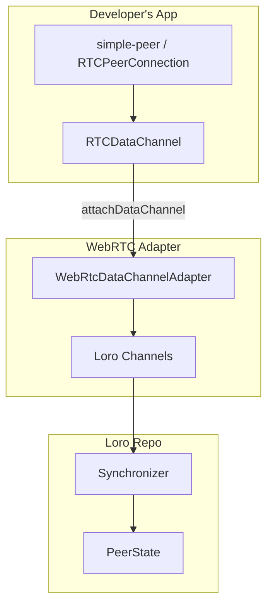
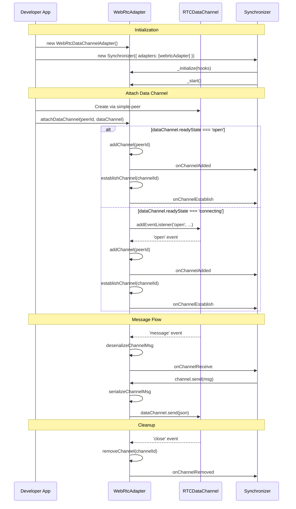

# WebRTC Data Channel Adapter Plan

## Overview

Create a WebRTC data channel adapter for loro-extended that allows developers to attach existing `RTCDataChannel` instances from their WebRTC setup (e.g., simple-peer) to enable Loro document synchronization over peer-to-peer connections.

## Design Goals

1. **Flexible Integration**: Accept `RTCDataChannel` instances from any WebRTC implementation (simple-peer, native WebRTC, etc.)
2. **Non-Intrusive**: Don't manage WebRTC connections - let developers use their existing signaling and connection setup
3. **Multi-Channel Support**: Support multiple simultaneous peer connections
4. **Proper Lifecycle**: Handle data channel open/close events correctly
5. **Efficient Serialization**: Use JSON serialization (like SSE adapter) for compatibility

## Architecture



## API Design

### Constructor

```typescript
import { WebRtcDataChannelAdapter } from "@loro-extended/adapter-webrtc"

const webrtcAdapter = new WebRtcDataChannelAdapter()
```

### Public Methods

```typescript
interface WebRtcDataChannelAdapter {
  /**
   * Attach a data channel for a remote peer.
   * Creates a Loro channel when the data channel is open.
   * 
   * @param remotePeerId - The stable peer ID of the remote peer
   * @param dataChannel - The RTCDataChannel to use for communication
   * @returns A cleanup function to detach the channel
   */
  attachDataChannel(remotePeerId: PeerID, dataChannel: RTCDataChannel): () => void
  
  /**
   * Detach a data channel for a remote peer.
   * Removes the Loro channel and cleans up event listeners.
   * 
   * @param remotePeerId - The peer ID to detach
   */
  detachDataChannel(remotePeerId: PeerID): void
  
  /**
   * Check if a data channel is attached for a peer.
   * 
   * @param remotePeerId - The peer ID to check
   */
  hasDataChannel(remotePeerId: PeerID): boolean
}
```

## Implementation Details

### File Structure

```
adapters/webrtc/
├── package.json
├── tsconfig.json
├── tsup.config.ts
├── README.md
└── src/
    ├── index.ts           # Main export
    ├── adapter.ts         # WebRtcDataChannelAdapter class
    └── __tests__/
        └── adapter.test.ts
```

### Key Implementation Points

1. **Channel Context**: Use `remotePeerId` as the context type for the adapter's channel directory

2. **Data Channel State Handling**:
   - If `dataChannel.readyState === 'open'`: Create Loro channel immediately
   - If `dataChannel.readyState === 'connecting'`: Wait for 'open' event
   - On 'close' or 'error': Remove Loro channel

3. **Message Serialization**: Use `serializeChannelMsg` / `deserializeChannelMsg` from `@loro-extended/repo` (same as SSE adapter)

4. **Binary vs String**: RTCDataChannel supports both. Use string mode with JSON for simplicity and compatibility.

### Adapter Lifecycle



## Usage Example (Video Conference App)

```typescript
// main.tsx
import { WebRtcDataChannelAdapter } from "@loro-extended/adapter-webrtc"
import { SseClientNetworkAdapter } from "@loro-extended/adapter-sse/client"

const sseAdapter = new SseClientNetworkAdapter({
  postUrl: "/loro/sync",
  eventSourceUrl: peerId => `/loro/events?peerId=${peerId}`,
})

const webrtcAdapter = new WebRtcDataChannelAdapter()

const config: RepoParams = {
  identity: { peerId, name: displayName, type: "user" },
  adapters: [sseAdapter, webrtcAdapter],
}

// In use-peer-manager.ts or similar
function usePeerManager({ webrtcAdapter, ... }) {
  const createPeer = useCallback((remotePeerId: PeerID) => {
    const peer = new Peer({ ... })
    
    peer.on("connect", () => {
      // Get the data channel from simple-peer
      // Note: simple-peer creates a data channel internally
      // We need to access it or create our own
      const dataChannel = peer._channel // or create dedicated channel
      
      webrtcAdapter.attachDataChannel(remotePeerId, dataChannel)
    })
    
    peer.on("close", () => {
      webrtcAdapter.detachDataChannel(remotePeerId)
    })
  }, [webrtcAdapter])
}
```

## Integration with simple-peer

simple-peer creates a data channel internally for its own use. For Loro sync, we have two options:

### Option 1: Create a Dedicated Data Channel

```typescript
// After peer connection is established
peer.on("connect", () => {
  // Create a dedicated channel for Loro sync
  const loroChannel = peer._pc.createDataChannel("loro-sync", {
    ordered: true,
  })
  webrtcAdapter.attachDataChannel(remotePeerId, loroChannel)
})
```

### Option 2: Use simple-peer's Built-in Channel

```typescript
// simple-peer exposes send() and 'data' events
// We could create a wrapper that implements RTCDataChannel interface
// This is more complex and may not be worth it
```

**Recommendation**: Option 1 (dedicated data channel) is cleaner and more reliable.

## Todo List

1. [ ] Create package structure (package.json, tsconfig.json, tsup.config.ts)
2. [ ] Implement `WebRtcDataChannelAdapter` class extending `Adapter<PeerID>`
3. [ ] Implement `attachDataChannel()` method
4. [ ] Implement `detachDataChannel()` method  
5. [ ] Implement `hasDataChannel()` method
6. [ ] Implement `generate()` method for channel creation
7. [ ] Handle data channel lifecycle events (open, close, error, message)
8. [ ] Add unit tests
9. [ ] Create README with usage examples
10. [ ] Update video-conference example to use the adapter

## Open Questions

1. **Data Channel Configuration**: Should we allow configuration options for the data channel (ordered, maxRetransmits, etc.) when the developer creates their own?
   - **Answer**: No, the developer controls this since they create the data channel

2. **Multiple Data Channels per Peer**: Should we support multiple data channels to the same peer?
   - **Answer**: No, one Loro channel per peer is sufficient. Multiple channels would create duplicate sync traffic.

3. **Reconnection Handling**: If a data channel closes and reopens, should we automatically re-establish?
   - **Answer**: The developer calls `attachDataChannel` again when they create a new connection. The adapter doesn't manage reconnection.