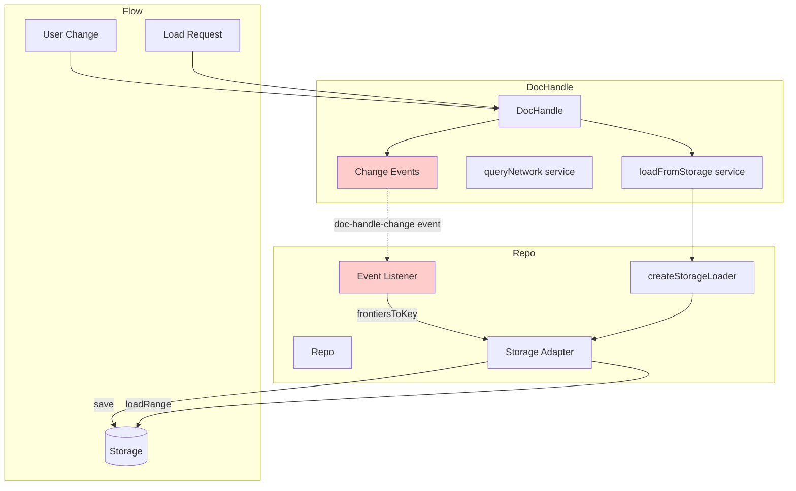
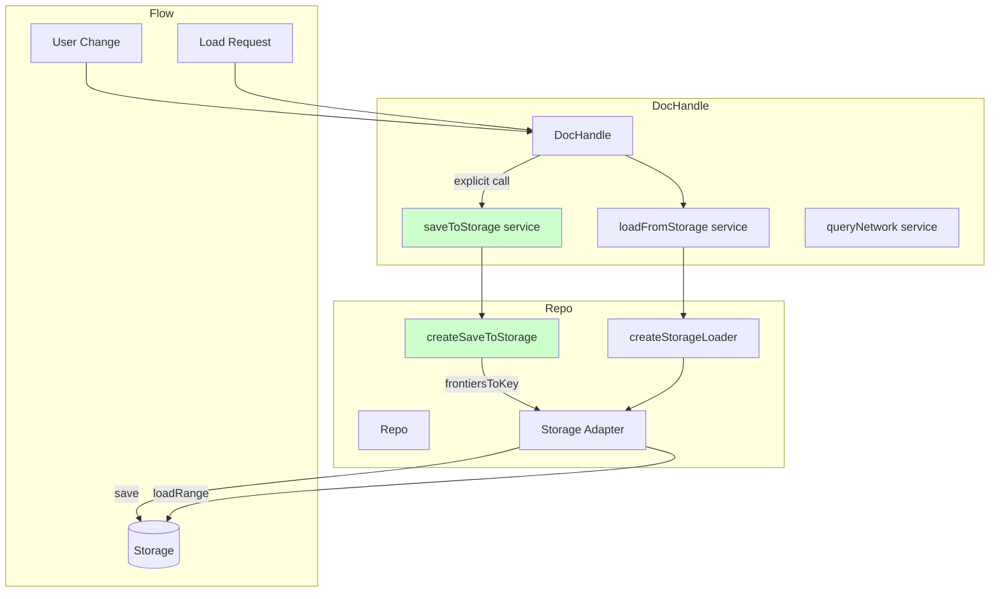

# Storage Architecture Refactoring: From Event-Driven to Service-Driven

## Executive Summary

We successfully refactored the Loro Repo storage architecture to move from an implicit, event-driven pattern to an explicit, service-driven pattern. This change improves testability, makes the storage contract explicit, and creates architectural symmetry in the DocHandleServices interface.

## The Problem

The original architecture had several issues:

1. **Asymmetric Interface**: DocHandle had `loadFromStorage` but no `saveToStorage` service
2. **Implicit Persistence**: DocHandle didn't know its changes were being persisted
3. **Event-Driven Coupling**: Repo listened to DocHandle's internal events for storage
4. **Testing Challenges**: Couldn't test persistence at the DocHandle level in isolation

## Architecture Before Refactoring



### Problems with Event-Driven Approach

- **Hidden Dependency**: Storage depends on event emission that DocHandle doesn't know about
- **Fragile**: If event listener fails or is removed, storage silently stops working
- **Asymmetric**: Load is explicit (service), save is implicit (event)
- **Untestable**: Can't mock storage behavior in DocHandle tests

## Architecture After Refactoring



### Benefits of Service-Driven Approach

- **Explicit Contract**: DocHandle knows it's saving via the service
- **Testable**: Can mock saveToStorage in tests
- **Symmetric**: Both load and save are services
- **Reliable**: No hidden dependencies on event propagation

## Implementation Details

### 1. Updated DocHandleServices Interface

```typescript
export interface DocHandleServices<T extends DocContent> {
  /** Load document from storage */
  loadFromStorage: (documentId: DocumentId) => Promise<LoroDoc<T> | null>
  
  /** Save document to storage (NEW) */
  saveToStorage?: (
    documentId: DocumentId,
    doc: LoroDoc<T>,
    event: LoroEventBatch
  ) => Promise<void>
  
  /** Query document from network */
  queryNetwork: (
    documentId: DocumentId,
    timeout: number
  ) => Promise<LoroDoc<T> | null>
}
```

### 2. DocHandle Storage Integration

The DocHandle now explicitly calls saveToStorage when changes occur:

```typescript
// In cmd-subscribe-to-doc command handler
command.doc.subscribe(event => {
  // Emit event for compatibility
  this._emitter.emit("doc-handle-change", { doc: command.doc, event })
  
  // Explicitly save to storage if service is available
  if (this.#services.saveToStorage && (event.by === "local" || event.by === "import")) {
    const savePromise = this.#services.saveToStorage(this.documentId, command.doc, event)
    if (savePromise && typeof savePromise.catch === 'function') {
      savePromise.catch(error => {
        console.error(`Failed to save document ${this.documentId} to storage:`, error)
      })
    }
  }
})
```

### 3. Repo Provides Storage Services

The Repo creates and injects both load and save services:

```typescript
private createSaveToStorage<T extends DocContent>(
  documentId: DocumentId
): (documentId: DocumentId, doc: LoroDoc<T>, event: LoroEventBatch) => Promise<void> {
  return async (_, doc, event) => {
    if (event.by === "local" || event.by === "import") {
      const frontiersKey = this.frontiersToKey(event.to)
      const fromVersion = doc.frontiersToVV(event.from)
      const update = doc.export({ mode: "update", from: fromVersion })
      
      await this.storageAdapter.save(
        [documentId, "update", frontiersKey],
        update
      )
    }
  }
}

// In getOrCreateHandle
const handle = new DocHandle<T>(documentId, {
  loadFromStorage: createStorageLoader<T>(this.storageAdapter),
  saveToStorage: this.createSaveToStorage<T>(documentId),  // NEW
  queryNetwork: this.synchronizer.queryNetwork.bind(this.synchronizer),
})
```

## Migration Path

### Backward Compatibility

The refactoring maintains backward compatibility:

1. **Optional Service**: `saveToStorage` is optional in the interface
2. **Event Emission Continues**: DocHandle still emits events for other consumers
3. **Graceful Degradation**: System works without saveToStorage service

### Testing Strategy

New tests verify the service-driven storage:

```typescript
it("should call saveToStorage service when local changes occur", async () => {
  const saveToStorage = vi.fn().mockResolvedValue(undefined)
  const services: DocHandleServices<DocContent> = {
    loadFromStorage: vi.fn().mockResolvedValue(doc),
    saveToStorage,  // Mock service
    queryNetwork: vi.fn(),
  }
  
  const handle = new DocHandle("test-doc", services)
  await handle.find()
  
  handle.change(doc => {
    doc.getMap("root").set("text", "hello")
  })
  
  await new Promise(resolve => setTimeout(resolve, 10))
  
  expect(saveToStorage).toHaveBeenCalledWith(
    "test-doc",
    expect.any(LoroDoc),
    expect.objectContaining({ by: "local" })
  )
})
```

## Results

### Before
- ❌ Implicit storage through event listeners
- ❌ Asymmetric interface (load but no save)
- ❌ Hard to test storage in isolation
- ❌ Silent failures if event listener breaks

### After
- ✅ Explicit storage through service injection
- ✅ Symmetric interface (both load and save)
- ✅ Easy to test with mocked services
- ✅ Clear error handling for storage failures
- ✅ All 88 tests passing
- ✅ Backward compatible

## Key Architectural Principles

1. **Explicit over Implicit**: Storage is now an explicit service call, not a hidden side effect
2. **Dependency Injection**: Services are injected, making testing and mocking straightforward
3. **Single Responsibility**: DocHandle manages document state, Repo provides storage implementation
4. **Fail-Safe**: Storage errors are caught and logged but don't crash the system

## Future Enhancements

With this foundation, we can now easily:

1. **Add Storage Strategies**: Different save strategies per document type
2. **Implement Batching**: Batch multiple saves for efficiency
3. **Add Compression**: Compress updates before storage
4. **Implement Snapshots**: Periodic snapshot creation for faster loads
5. **Add Metrics**: Track storage performance and failures

## Conclusion

This refactoring successfully transforms the storage architecture from an implicit, event-driven pattern to an explicit, service-driven pattern. The change improves code clarity, testability, and maintainability while preserving backward compatibility and all existing functionality.