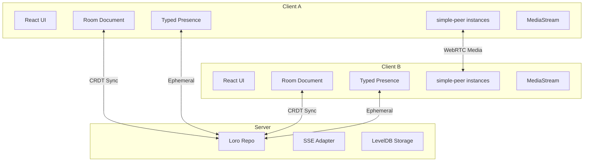

# WebRTC Video Conference App - Implementation Plan

## Overview

A simple WebRTC-based video conference app using `simple-peer` and `loro-extended`. This app demonstrates how to use:
- **CRDT documents** for persistent room state (participants, metadata)
- **Typed presence** for ephemeral WebRTC signaling (SDP offers/answers, ICE candidates)
- **SSE + HTTP POST** for all communication (no WebSockets)

## Key simple-peer Concepts

From the simple-peer documentation:

1. **Signaling**: The `signal` event emits data that must be sent to the remote peer. Call `peer.signal(data)` on the remote peer with this data. The data contains WebRTC offers, answers, and ICE candidates.

2. **Initiator**: One peer must be the `initiator: true`. We'll use lexicographic peerId comparison to determine this deterministically.

3. **Trickle ICE**: By default, `trickle: true` means multiple signal events fire (offer/answer + ICE candidates). We'll keep trickle enabled for faster connection establishment.

4. **Stream**: Pass `stream` option from `getUserMedia` to send video/audio. The remote peer receives it via the `stream` event.

5. **Full Mesh**: For N peers, each peer maintains N-1 connections. Total connections = N*(N-1)/2.

## Architecture



## Data Model

### Room Document (Persistent CRDT)

```typescript
const RoomSchema = Shape.doc({
  // Room metadata
  name: Shape.text(),
  createdAt: Shape.plain.number(),
  
  // Participant list - who has joined the room
  participants: Shape.list(
    Shape.map({
      peerId: Shape.plain.string(),
      name: Shape.plain.string(),
      joinedAt: Shape.plain.number(),
    })
  ),
})
```

### Signaling Presence (Ephemeral)

```typescript
const SignalingPresenceSchema = Shape.plain.object({
  // Current media preferences
  wantsAudio: Shape.plain.boolean(),
  wantsVideo: Shape.plain.boolean(),
  
  // WebRTC signaling - keyed by target peerId
  // Each entry contains the signal data to send to that peer
  signals: Shape.plain.object({
    // Dynamic keys: targetPeerId -> signal data
    // Signal data is the simple-peer signal object (SDP or ICE candidate)
  }),
})

const EmptySignalingPresence = {
  wantsAudio: true,
  wantsVideo: true,
  signals: {},
}
```

## Signaling Flow via Presence

The key insight is that presence is **per-peer** and **ephemeral**. Each peer publishes their outgoing signals in their own presence, and other peers read from it:

```
1. Client A wants to connect to Client B
2. Client A creates simple-peer with initiator=true
3. simple-peer emits "signal" event with SDP offer
4. Client A sets presence: { signals: { [clientB_peerId]: offerData } }
5. Presence propagates via loro-extended (SSE)
6. Client B reads Client A's presence, sees signal for itself
7. Client B passes signal to its simple-peer instance
8. simple-peer emits "signal" event with SDP answer
9. Client B sets presence: { signals: { [clientA_peerId]: answerData } }
10. Client A reads Client B's presence, passes to simple-peer
11. ICE candidates flow the same way
12. Connection established!
```

### Signal Accumulation Strategy

Since trickle ICE is enabled by default, multiple signals fire in sequence:
1. SDP offer/answer (contains initial ICE candidates gathered before timeout)
2. Additional ICE candidates as they're discovered

We'll accumulate signals as an array keyed by target peerId:

```typescript
signals: {
  [targetPeerId]: SignalData[]  // Array of pending signals for that peer
}
```

**Signal Flow:**
1. Peer A's simple-peer emits `signal` event with offer
2. Peer A appends to `presence.signals[peerB_id]`
3. Presence propagates via loro-extended SSE
4. Peer B reads Peer A's presence, finds signals addressed to itself
5. Peer B calls `peer.signal(data)` for each signal in order
6. Peer B's simple-peer emits `signal` event with answer
7. Process repeats for ICE candidates

**Deduplication:** Each peer tracks which signals it has already processed using a Set of signal hashes to avoid re-processing on presence updates.

## Project Structure

```
examples/video-conference/
├── index.html
├── package.json
├── tsconfig.json
├── tsconfig.app.json
├── tsconfig.node.json
├── vite.config.ts
├── src/
│   ├── main.tsx                 # Entry point with RepoProvider
│   ├── index.css                # Tailwind styles
│   ├── vite-env.d.ts
│   ├── client/
│   │   ├── video-conference-app.tsx  # Main app component
│   │   ├── video-bubble.tsx          # Video display component
│   │   ├── use-room-id-from-hash.ts  # URL hash management
│   │   ├── use-local-media.ts        # getUserMedia hook
│   │   └── use-webrtc-mesh.ts        # simple-peer mesh management
│   ├── server/
│   │   ├── server.ts            # Express + loro-extended server
│   │   ├── config.ts            # Server configuration
│   │   └── logger.ts            # Logging setup
│   └── shared/
│       └── types.ts             # Shared schemas and types
```

## Implementation Milestones

### Milestone 1: Project Setup & Room Document
**Goal**: Basic app structure with room document sync (no WebRTC yet)

- [ ] Create project structure based on chat example
- [ ] Define `RoomSchema` and `SignalingPresenceSchema`
- [ ] Set up Express server with loro-extended SSE
- [ ] Set up Vite client with RepoProvider
- [ ] Create basic UI showing room participants
- [ ] Implement join/leave room functionality via CRDT

### Milestone 2: Local Media & UI
**Goal**: Capture and display local video/audio

- [ ] Create `useLocalMedia` hook for getUserMedia
- [ ] Create `VideoBubble` component for video display
- [ ] Add media controls (mute audio/video)
- [ ] Display local video preview
- [ ] Update presence with `wantsAudio`/`wantsVideo`

### Milestone 3: WebRTC Signaling via Presence
**Goal**: Exchange WebRTC signals through loro-extended presence

- [ ] Create `useWebRtcMesh` hook
- [ ] Implement signal publishing via presence
- [ ] Implement signal consumption from other peers' presence
- [ ] Handle initiator determination (lexicographic peerId comparison)
- [ ] Test signaling flow between two peers

### Milestone 4: simple-peer Integration
**Goal**: Establish actual WebRTC connections

- [ ] Install and configure simple-peer
- [ ] Create peer instances when participants join
- [ ] Wire signal events to presence
- [ ] Handle stream events to display remote video
- [ ] Handle peer cleanup on disconnect

### Milestone 5: Polish & Edge Cases
**Goal**: Production-ready experience

- [ ] Handle reconnection scenarios
- [ ] Add connection status indicators
- [ ] Improve UI/UX (circular bubbles, overlays)
- [ ] Add room sharing (copy link)
- [ ] Handle browser permissions gracefully
- [ ] Test with 3+ participants

## Key Implementation Details

### Initiator Determination

To avoid double-negotiation, use deterministic initiator selection:

```typescript
const isInitiator = myPeerId < remotePeerId
```

The peer with the lexicographically smaller peerId initiates the connection.

### Signal Queue Management

Signals accumulate in presence until processed:

```typescript
// In useWebRtcMesh
const [processedSignals, setProcessedSignals] = useState<Set<string>>()

// When reading signals from other peers' presence
for (const [fromPeerId, signals] of Object.entries(otherPeerPresence.signals)) {
  for (const signal of signals) {
    const signalId = `${fromPeerId}:${JSON.stringify(signal)}`
    if (!processedSignals.has(signalId)) {
      peer.signal(signal)
      setProcessedSignals(prev => new Set([...prev, signalId]))
    }
  }
}
```

### Peer Lifecycle

```typescript
// When participant list changes
useEffect(() => {
  const currentPeerIds = new Set(peers.keys())
  const participantPeerIds = new Set(
    doc.participants
      .map(p => p.peerId)
      .filter(id => id !== myPeerId)
  )
  
  // Create peers for new participants
  for (const peerId of participantPeerIds) {
    if (!currentPeerIds.has(peerId)) {
      createPeer(peerId)
    }
  }
  
  // Destroy peers for removed participants
  for (const peerId of currentPeerIds) {
    if (!participantPeerIds.has(peerId)) {
      destroyPeer(peerId)
    }
  }
}, [doc.participants])
```

### ICE Servers

simple-peer defaults include Google STUN servers. For production, add TURN servers for NAT traversal:

```typescript
const config = {
  iceServers: [
    { urls: 'stun:stun.l.google.com:19302' },
    { urls: 'stun:global.stun.twilio.com:3478' },
    // Add TURN servers for production NAT traversal
    // { urls: 'turn:your-turn-server.com', username: '...', credential: '...' }
  ]
}

// Pass to simple-peer
new Peer({ initiator, stream, config })
```

### simple-peer Instance Management

```typescript
// Create peer for remote participant
function createPeer(remotePeerId: string, localStream: MediaStream) {
  const isInitiator = myPeerId < remotePeerId
  
  const peer = new Peer({
    initiator: isInitiator,
    stream: localStream,
    trickle: true,  // Enable trickle ICE for faster connections
    config: { iceServers }
  })
  
  // When simple-peer wants to send signaling data
  peer.on('signal', (data) => {
    // Append to our presence for this target peer
    setSelf(prev => ({
      ...prev,
      signals: {
        ...prev.signals,
        [remotePeerId]: [...(prev.signals[remotePeerId] || []), data]
      }
    }))
  })
  
  // When we receive the remote stream
  peer.on('stream', (remoteStream) => {
    setRemoteStreams(prev => new Map(prev).set(remotePeerId, remoteStream))
  })
  
  // Connection established
  peer.on('connect', () => {
    console.log(`Connected to ${remotePeerId}`)
    // Optionally clear signals from presence once connected
  })
  
  peer.on('close', () => {
    cleanupPeer(remotePeerId)
  })
  
  peer.on('error', (err) => {
    console.error(`Peer error with ${remotePeerId}:`, err)
    cleanupPeer(remotePeerId)
  })
  
  return peer
}
```

## Dependencies

```json
{
  "dependencies": {
    "@loro-extended/adapters": "workspace:^",
    "@loro-extended/change": "workspace:^",
    "@loro-extended/react": "workspace:^",
    "@loro-extended/repo": "workspace:^",
    "classic-level": "^1.2.0",
    "cors": "^2.8.5",
    "express": "^4.19.2",
    "react": "^19.1.0",
    "react-dom": "^19.1.0",
    "simple-peer": "^9.11.1"
  },
  "devDependencies": {
    "@tailwindcss/vite": "^4.1.17",
    "@types/simple-peer": "^9.11.8",
    "@vitejs/plugin-react": "^4.6.0",
    "concurrently": "^8.2.2",
    "tailwindcss": "^4.1.17",
    "tsx": "^4.20.3",
    "typescript": "~5.8.3",
    "vite": "^7.0.4",
    "vite-plugin-top-level-await": "^1.6.0",
    "vite-plugin-wasm": "^3.5.0"
  }
}
```

## Testing Strategy

1. **Unit tests**: Test signal queue logic, initiator determination
2. **Integration tests**: Test presence propagation with multiple repos
3. **Manual testing**: 
   - Open app in 2-3 browser tabs
   - Verify video/audio streams connect
   - Test join/leave scenarios
   - Test network interruption recovery

## simple-peer Events Reference

| Event | Description | Our Usage |
|-------|-------------|-----------|
| `signal` | Signaling data to send to remote peer | Publish to presence |
| `connect` | Data channel ready | Log, optionally clear signals |
| `data` | Received data channel message | Not used (video only) |
| `stream` | Received remote media stream | Display in VideoBubble |
| `track` | Received individual track | Alternative to stream |
| `close` | Connection closed | Cleanup peer instance |
| `error` | Fatal error occurred | Cleanup and log |

## Open Questions

1. **Signal cleanup**: When should we clear processed signals from presence?
   - **Recommendation**: Clear after `connect` event fires. Presence timeout (30s) provides safety net.

2. **Renegotiation**: How to handle adding/removing tracks after connection?
   - simple-peer supports `addTrack`/`removeTrack` which triggers new `signal` events
   - Same presence-based signaling flow applies

3. **Large rooms**: For >5 participants, consider SFU architecture instead of mesh.
   - Out of scope for this example
   - Mesh scales as O(n²) connections

4. **Browser compatibility**: simple-peer works in all modern browsers
   - `Peer.WEBRTC_SUPPORT` can check for support
   - getUserMedia requires HTTPS in production