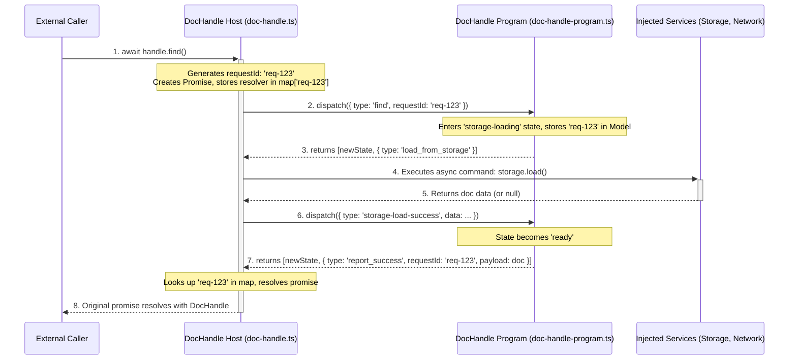

# DocHandle: A TEA Host-as-Orchestrator Deep Dive

This document details the architectural refactor of the `DocHandle` class, which now serves as a robust bridge between the asynchronous, promise-based world of a typical application and the synchronous, pure state machine of its underlying `doc-handle-program`. This "Host-as-Orchestrator" model is the standard for TEA-based components in this project, and the patterns established here should be followed when refactoring the `Repo` class.

## 1. The Core Problem: Bridging Async and Sync

The original `DocHandle` had a "fire-and-forget" API. Methods like `find()` and `create()` dispatched messages to the internal state machine but provided no way for the caller to `await` a result. This made it difficult to compose asynchronous workflows.

The goal of this refactor was to convert the public API to be fully `async`, returning promises that resolve or reject only when the underlying state machine reaches a definitive terminal state for that specific request.

## 2. The Solution: Host-as-Orchestrator

We solved this by implementing the "Host-as-Orchestrator" pattern. The `DocHandle` host class takes on the responsibility of managing the lifecycle of requests initiated by its public methods.

### How It Works: The `RequestId` Flow

1.  **Request Initiation**: When a public method like `handle.find()` is called, the **host** (the `DocHandle` instance) immediately does two things:
    *   Generates a unique `RequestId` (using `uuid`).
    *   Creates a new `Promise` and stores its `resolve` and `reject` functions in a private map (`#pendingRequests`), keyed by the `RequestId`.

2.  **Dispatch**: The host dispatches the initial `Message` (e.g., `{ type: "msg-find" }`) to the **pure program**, including the `RequestId`.

3.  **State Machine Logic**: The pure program (`doc-handle-program.ts`) is now aware of `RequestId`. Its `Model` was updated to store the `RequestId` in its loading states (e.g., `StorageLoadingState`, `NetworkLoadingState`). The program proceeds through its states as before, but it now "remembers" which request initiated the current sequence of operations.

4.  **Terminal State & Reporting**: When the program reaches a terminal state for the request (e.g., the document is `ready` or `unavailable`), its `update` function issues a new type of `Command`:
    *   `{ type: "cmd-report-success", requestId: "...", payload: doc }`
    *   `{ type: "cmd-report-failure", requestId: "...", error: new Error(...) }`

5.  **Promise Resolution**: The host's `#executeCommand` method handles these new commands. It looks up the `RequestId` in its `#pendingRequests` map and calls the corresponding `resolve` or `reject` function, thus fulfilling the promise that the original caller is awaiting. The completed request is then deleted from the map to prevent memory leaks.

### Mermaid Diagram:

## 3. Key Learnings & Architectural Decisions

This refactor produced several important insights that should be applied to the upcoming `Repo` refactor.

### Learning: The Host is a "Dumb" Command Executor

Our most critical learning moment was correctly defining the host's responsibility regarding timeouts. An initial impulse was to add a `setTimeout` to the host's promise logic as a "safety net." **This was wrong.**

The correct pattern, as demonstrated in the `Synchronizer` and now implemented here, is:
*   **The program controls timeouts.** The pure program issues a `set_timeout` command.
*   **The host executes timeouts.** The host's `#executeCommand` method calls `setTimeout`.
*   **The timeout dispatches a message.** The `setTimeout` callback *does not reject the promise*. It dispatches a new message (e.g., `network-timeout`) back into the pure program.
*   **The program decides what failure means.** The `update` function handles the timeout message and determines the next state. Only then does it issue a `report_failure` command, which causes the host to reject the promise.

This preserves the architectural purity of the system. The host's only job is to execute commands and translate external events into messages; all logic resides within the pure program.

### Trade-off: State Complexity vs. Host Complexity

Adding the `RequestId` and new loading states (like `creating`) to the pure program's `Model` increases its complexity slightly. However, this is the correct trade-off. It keeps all state, including in-flight request state, within the predictable, testable, pure-functional core. The alternative—managing this logic in the host—would lead to impure, hard-to-test code and potential race conditions.

### Guidance for the `Repo` Refactor

When refactoring the `Repo` class, follow this exact pattern:
1.  Identify the public methods that need to become asynchronous (e.g., `create`, `find`, `findOrCreate`).
2.  Add a `#pendingRequests` map to the `Repo` class.
3.  Update the `repo-program`'s `Message`, `Model`, and `Command` types to include the `RequestId` and reporting commands, just as we did for the `doc-handle-program`.
4.  The `Repo`'s public methods will generate a `RequestId`, create and store a promise, and dispatch a message to the `repo-program`.
5.  The `repo-program` will, in turn, dispatch messages to the appropriate `DocHandle`. Crucially, when the child `DocHandle`'s program reports success or failure, the `Repo`'s program must chain this result, issuing its own `report_success`/`report_failure` command to resolve the promise held by the `Repo` host.
6.  Update all tests to use `async/await` and to properly check for promise resolutions and rejections.

By adhering to this model, we can ensure that all TEA-based components in the system are consistent, robust, and maintainable.