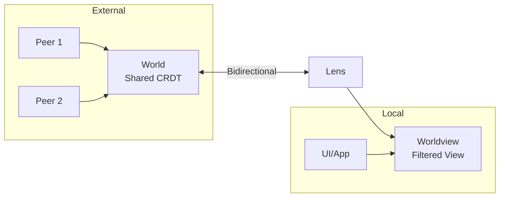

Excellent question. Let me enumerate the requirements of a lens thoroughly, based on the code, tests, and documentation I've analyzed.

---

# Lens Requirements: A Thorough Enumeration

## Core Concept

A **Lens** creates a **worldview** (filtered perspective) from a **world** (shared CRDT document). It enables bidirectional synchronization with filtering.



---

## Requirement 1: Filtered Import (World → Worldview)

### 1.1 Commit-Level Filtering

When external changes are imported to the world, the lens must filter them at the **commit level** before applying to the worldview.

```typescript
// Filter receives parsed commit info
filter: (info: CommitInfo) => boolean;

interface CommitInfo {
  peerId: string; // Who made the commit
  counter: number; // Commit sequence number
  timestamp: number; // When it was made
  message: unknown; // Parsed JSON message (or undefined)
  raw: JsonChange; // Raw commit data
}
```

### 1.2 Causal Consistency

If commit N from a peer is rejected, all subsequent commits (N+1, N+2, ...) from that peer **in the same batch** must also be rejected to maintain causal consistency.

### 1.3 World Retains All Data

The world document must retain ALL commits (for CRDT convergence), even those filtered out of the worldview.

---

## Requirement 2: Local Change Propagation (Worldview → World)

### 2.1 State-Based Propagation via applyDiff

Local changes made via `change(lens, fn)` must propagate to the world using **applyDiff** (not import). This is critical for "sovereign intention preservation" - ensuring local writes always win regardless of concurrent filtered-out changes.

```typescript
// From sovereign.test.ts - demonstrates why applyDiff is needed
// With import(): Alice's write may LOSE to Bob's due to CRDT convergence
// With applyDiff(): Alice's write ALWAYS WINS (state transformation)
```

### 2.2 Commit Message Propagation

Commit messages attached to local changes must propagate through to the world document.

```typescript
change(
  lens,
  (d) => {
    d.counter.increment(1);
  },
  { commitMessage: { playerId: "alice" } },
);
// The world should have this commit message
```

---

## Requirement 3: Chained Lens Composition

### 3.1 Lenses Can Be Chained

A lens can be created from another lens's worldview:

```typescript
const lens1 = createLens(world);
const lens2 = createLens(lens1.worldview); // Chained
const lens3 = createLens(lens2.worldview); // Three-level chain
```

### 3.2 Changes Propagate Through Chain

Changes made at any level must propagate all the way to the root world:

```typescript
change(lens3, (d) => d.counter.increment(1));
// Should update: lens3.worldview, lens2.worldview, lens1.worldview, world
```

### 3.3 Filters Apply at Each Level

Each lens in the chain applies its own filter independently.

### 3.4 Commit Messages Propagate Through Chain

Commit messages must propagate through the entire chain to the root world.

---

## Requirement 4: Event Subscription Behavior

### 4.1 Developer Subscriptions Must Work

Developers must be able to subscribe to the worldview and receive events:

```typescript
loro(lens.worldview).subscribe((event) => {
  if (event.by === "local") {
    /* local change */
  }
  if (event.by === "import") {
    /* filtered import */
  }
});
```

### 4.2 Local Events for Local Changes

When `change(lens, fn)` is called, the worldview must fire a "local" event.

### 4.3 Import Events for Filtered Imports

When external changes are imported to the world and pass the filter, the worldview must fire an "import" event.

### 4.4 Reactive Patterns Must Work

Developers must be able to call `change(lens, ...)` in response to events without causing:

- Infinite loops
- Double-application of changes
- Corrupted state

---

## Requirement 5: Peer ID Separation

### 5.1 Separate Peer IDs

The worldview has its own unique peer ID (different from the world's). This is safe because:

- **Outbound** (worldview → world): `applyDiff` + `commit()` creates new ops with the world's peer ID
- **Inbound** (world → worldview): `import` preserves original authors' peer IDs

```typescript
// fork() automatically assigns a new unique peerId - we don't override it
const worldviewLoroDoc = worldLoroDoc.fork();
```

Using separate peer IDs:

- Avoids potential `(peerId, counter)` collisions between world and worldview ops
- Aligns with Loro's expectations about peer ID uniqueness
- Improves debugging clarity (worldview ops are clearly distinct from world ops)

---

## Requirement 6: Lifecycle Management

### 6.1 Dispose Cleanup

`lens.dispose()` must:

- Unsubscribe from all internal subscriptions
- Stop processing new events
- Be idempotent (safe to call multiple times)

### 6.2 Post-Dispose Behavior

After dispose:

- `change(lens, fn)` should be a no-op
- External imports should not reach the worldview

---

## Requirement 7: Edge Cases

### 7.1 No-Op Changes

Empty changes (no mutations) should be handled gracefully without errors.

### 7.2 Filter Exceptions

If a filter function throws, the commit should be rejected (fail-safe).

### 7.3 Concurrent Operations

Local changes during external import processing should work correctly.

---

## Implementation Notes

The current implementation handles these concerns correctly:

### Re-entrant Change Calls

When `change(lens, ...)` is called inside a subscription callback (reactive pattern), the implementation uses a queue-based approach to prevent double-propagation. Changes are queued and processed in order after the current operation completes.

### Peer ID Separation

The worldview has its own unique peer ID (from `fork()`), which:

- Avoids potential `(peerId, counter)` collisions between world and worldview ops
- Aligns with Loro's expectations about peer ID uniqueness
- Requires tracking both world frontiers (`lastKnownWorldFrontiers`) and worldview frontiers (`lastKnownWorldviewFrontiers`) separately for correct diff computation

### Architecture

The implementation uses:

- Dual subscriptions (world for inbound filtering, worldview for chained lens propagation)
- Module-level WeakMap for commit message passing through lens chains
- Separate frontier tracking for world and worldview (necessary due to different peer IDs)
- Queue-based re-entrancy handling with `isProcessing` flag

---

## Simplified Mental Model

A lens should be conceptually simple:

```
┌────────────────────────────────────────────────────────┐
│                         LENS                           │
│                                                        │
│  ┌─────────┐    filter()    ┌────────────┐             │
│  │  World  │ ──────────────>│ Worldview  │             │
│  │  (src)  │                │   (view)   │             │
│  │         │<───────────────│            │             │
│  └─────────┘   applyDiff()  └────────────┘             │
│                                                        │
│  Invariants:                                           │
│  1. World has ALL commits (for CRDT convergence)       │
│  2. Worldview has FILTERED commits                     │
│  3. Local changes go: worldview → applyDiff → world    │
│  4. External changes go: world → filter → worldview    │
│  5. Events fire correctly for both directions          │
└────────────────────────────────────────────────────────┘
```

---

## Questions for Simplification

1. **Do we need the 4-state machine?** Could a simple boolean `isProcessing` suffice?

2. **Do we need dual subscriptions?** Could we use a single subscription point?

3. **Is the WeakMap for message passing necessary?** Could we pass messages through function parameters?

4. **Can we simplify frontier tracking?** The current approach is error-prone.

5. **Should reactive patterns be supported?** Or should we document that calling `change(lens, ...)` inside a subscription is unsupported?

Would you like me to propose a simplified architecture based on these requirements?
