# Loro DocHandle Architecture

This document outlines the architecture for the `DocHandle`, a core component in the Loro state synchronization system. The `DocHandle` is responsible for managing the lifecycle, state, and synchronization of a single Loro document.

## 1. Core Purpose

A `DocHandle` is a stateful wrapper around a single `LoroDoc` instance. It provides a higher-level, user-friendly API that abstracts the complexities of document loading, state management, and interaction with storage and network layers.

At its core, the `DocHandle` implements **The Elm Architecture (TEA)**. It hosts a pure, synchronous state machine (defined in `doc-handle-program.ts`) and acts as the runtime for executing the side effects (like I/O) that the state machine describes.

Key responsibilities include:

- Managing the document's lifecycle (`idle`, `storage-loading`, `ready`, etc.) through a predictable state machine.
- Providing a simple, intention-based API (`find`, `create`, `change`).
- Executing side effects (Commands) like storage access and network queries in a controlled manner.
- Emitting events when the document's state or content changes.

## 2. Architecture: Host-as-Orchestrator

To bridge the gap between a typical asynchronous application and the synchronous state machine, the `DocHandle` uses the **Host-as-Orchestrator** pattern.

When a public method like `handle.find()` is called, it returns a `Promise`. The `DocHandle` (the "host") generates a unique `RequestId` and stores the promise's resolver functions in a map. This `RequestId` is passed through the state machine. When the machine reaches a terminal state (`ready` or `unavailable`), it issues a `report_success` or `report_failure` command containing the original `RequestId`. The host then uses this ID to find and resolve the correct promise.

This pattern keeps the state machine pure and testable while providing a modern, `async/await`-friendly public API. All state, including that of in-flight requests, is managed by the pure program, and the host is a "dumb" executor of commands.

See `packages/docs/doc-handle-tea.md` for a more detailed technical breakdown and diagrams.

## 3. State Machine

The `DocHandle` is implemented as an explicit finite state machine.

```mermaid
stateDiagram-v2
    [*] --> create
    [*] --> find
    [*] --> findOrCreate

    state create {
        state "Idle" as Idle_c
        state "Ready" as Ready_c
        Idle_c --> Ready_c : create
    }

    state find {
        state "Idle" as Idle_f
        state "Ready" as Ready_f
        state "StorageLoading<div style='color:gray; font-weight: 300; margin-top: 5px'>(fallback:network)</div>" as Storage_f
        state "NetworkLoading<div style='color:gray; font-weight: 300; margin-top: 5px'>(timeout:500ms)</div>" as Network_f
        state "Unavailable" as Unavailable_f
        state "Deleted" as Deleted_f
        Idle_f --> Storage_f
        Storage_f --> Ready_f : found
        Storage_f --> Network_f : not found
        Storage_f --> Deleted_f : deleted
        Network_f --> Ready_f : found
        Network_f --> Unavailable_f : timeout
        Network_f --> Deleted_f : deleted
        Unavailable_f --> Ready_f : found (bg)
    }

    state findOrCreate {
        state "Idle" as Idle_foc
        state "Ready" as Ready_foc
        state "StorageLoading<div style='color:gray; font-weight: 300; margin-top: 5px'>(fallback:network)</div>" as Storage_foc
        state "NetworkLoading<div style='color:gray; font-weight: 300; margin-top: 5px'>(timeout:500ms)</div>" as Network_foc
        state "Deleted" as Deleted_foc
        Idle_foc --> Storage_foc
        Storage_foc --> Ready_foc : found
        Storage_foc --> Network_foc : not found
        Storage_foc --> Deleted_foc : deleted
        Network_foc --> Ready_foc : found
        Network_foc --> Ready_foc : timeout<div>(create)</div>
        Network_foc --> Deleted_foc : deleted
    }
```



### States

- **`Idle`**: The initial state. The handle exists, but no document loading has been initiated.
- **`StorageLoading`**: We are actively trying to load the document from the provided storage service in response to a `find` or `findOrCreate` call. The state tracks the original operation to determine the next step if storage fails.
- **`NetworkLoading`**: The document wasn't found in storage, so we are now asking peers on the network if they have it. For `findOrCreate`, this state includes a `createOnTimeout` flag to create the document if the network query times out.
- **`Creating`**: We are in the process of creating a new document from scratch.
- **`Ready`**: The document is loaded in memory and available for use. This is a terminal state for successful load/create operations.
- **`Unavailable`**: We couldn't find the document in storage or on the network within the allotted time. This is a terminal state for a `find` operation.
- **`Deleted`**: The document has been marked for deletion. This is a terminal state.

### Key Architectural Decisions

#### Operation-Based State Transitions

The `StorageLoading` state now tracks the original operation (`find` vs `findOrCreate`) rather than using a generic "fallback" field. This makes the intent clearer and the state transitions more predictable:

- `operation: "find"` → on storage failure, query network with no creation fallback
- `operation: "find-or-create"` → on storage failure, query network with creation fallback

#### Timeout Handling

The `findOrCreate` operation passes its timeout to the network layer, ensuring that:

- The user doesn't wait longer than expected
- The synchronizer respects user-specified timeouts
- No exponential backoff delays the creation of new documents

## 4. Core API

The `DocHandle<T>` exposes a minimal `async` API for interacting with the document.

```typescript
class DocHandle<T> extends EventEmitter<DocHandleEvents<T>> {
  public readonly documentId: DocumentId;

  // The string name of the current state (e.g., "idle").
  public get state(): HandleState<T>["state"];

  // The full, rich state object.
  public get stateObject(): HandleState<T>;

  // Asks the handle to find the doc in storage, then network.
  // Returns a promise that resolves with the handle when ready, or rejects if unavailable.
  public find(): Promise<DocHandle<T>>;

  // Asks the handle to find the doc, creating it if not found after a timeout.
  // Returns a promise that resolves with the handle when ready.
  public findOrCreate(options?: { timeout?: number }): Promise<DocHandle<T>>;

  // Asks the handle to create the doc immediately.
  // Returns a promise that resolves with the handle when ready.
  public create(options?: { initialValue?: () => T }): Promise<DocHandle<T>>;

  // Returns the underlying LoroProxyDoc. Throws if not 'ready'.
  public doc(): LoroProxyDoc<AsLoro<T>>;

  // The primary method for mutating the document. Throws if not 'ready'.
  public change(mutator: (doc: AsLoro<T>) => void): void;

  // Marks the document for deletion.
  public delete(): void;
}
```

## 5. Loading Strategy & Dependency Injection

The responsibility for persistence and network communication is delegated to the creator of the `DocHandle` (typically a `Repo` instance) through **dependency injection**. The `DocHandle` constructor accepts a `services` object that provides the concrete implementations for side effects.

```typescript
interface DocHandleServices<T> {
  loadFromStorage: (id: DocumentId) => Promise<LoroProxyDoc<AsLoro<T>> | null>;
  queryNetwork: (
    id: DocumentId,
    timeout: number
  ) => Promise<LoroProxyDoc<AsLoro<T>> | null>;
}

const handle = new DocHandle(documentId, {
  loadFromStorage: myStorage.load,
  queryNetwork: myNetwork.query,
});

const readyHandle = await handle.find();
```

This design decouples the `DocHandle`'s state management logic from any specific storage or network implementation, making it a highly reusable and testable component.

## 6. Event Emitter Interface

The `DocHandle` emits events to notify the application of important changes.

- **`on('state-change', (payload: { oldState: HandleState<T>; newState: HandleState<T> }) => void)`**: Fired whenever the handle's internal state transitions.
- **`on('change', (payload: { doc: LoroProxyDoc<AsLoro<T>> }) => void)`**: Fired whenever the document's content changes, either from a local `change()` or a remote sync message.
- **`on('sync-message', (message: Uint8Array) => void)`**: Fired when a local `change()` produces a sync message that needs to be broadcast to other peers.
