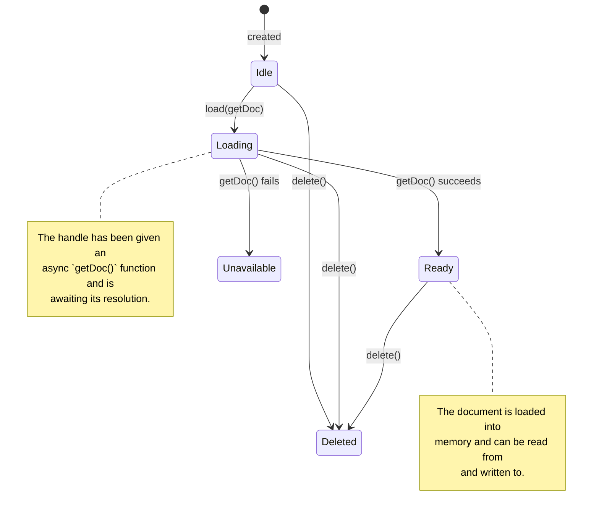

# Loro DocHandle Architecture

This document outlines the architecture for the `DocHandle`, a core component in the Loro state synchronization system. The `DocHandle` is responsible for managing the lifecycle, state, and synchronization of a single Loro document.

## 1. Core Purpose

A `DocHandle` is a stateful wrapper around a single `LoroDoc` instance. It provides a higher-level, user-friendly API that abstracts the complexities of document loading, state management, and interaction with storage and network layers. It is inspired by the `DocHandle` in Automerge-Repo but tailored to Loro's specific capabilities.

Key responsibilities include:
- Managing the document's lifecycle (`loading`, `ready`, etc.).
- Providing a simple `change()` API for mutations.
- Emitting events when the document changes.
- Abstracting the persistence strategy (snapshots and updates).
- Generating and applying sync messages for peer-to-peer communication.

## 2. State Machine

To ensure predictable and robust behavior, the `DocHandle` is implemented as an explicit finite state machine.



### States

- **`Idle`**: The initial state. The handle is instantiated but no data loading has been initiated. `load()` can be called.
- **`Loading`**: The handle is actively awaiting the resolution of the `getDoc()` promise passed to `load()`. In this state, `doc()` and `change()` will throw, but `whenReady()` can be used to await the outcome.
- **`Ready`**: The document was successfully loaded into memory and is available for mutation and reading.
- **`Unavailable`**: The `getDoc()` promise was rejected, meaning the document could not be loaded.
- **`Deleted`**: The document has been marked for deletion. This is a terminal state.

## 3. Core API

The `DocHandle<T>` will expose the following public API:

```typescript
import { type AsLoro, type LoroProxyDoc } from "loro-change";

class DocHandle<T> extends EventEmitter<DocHandleEvents<T>> {
  public readonly documentId: DocumentId;

  public get state(): HandleState;

  // Returns a promise that resolves when the handle is 'ready'.
  public whenReady(): Promise<void>;

  // Initiates loading by calling the provided async loader function.
  // Only callable when in the 'idle' state.
  public async load(getDoc: () => Promise<LoroProxyDoc<AsLoro<T>>>): Promise<void>;

  // Returns the underlying LoroProxyDoc. Throws if not 'ready'.
  public doc(): LoroProxyDoc<AsLoro<T>>;

  // The primary method for mutating the document. Throws if not 'ready'.
  public change(mutator: (doc: AsLoro<T>) => void): void;

  // Applies a sync message from a remote peer. Throws if not 'ready'.
  public applySyncMessage(message: Uint8Array): void;

  // Marks the document for deletion.
  public delete(): void;
}
```

## 4. Loading Strategy

The responsibility for persistence is delegated to the creator of the `DocHandle` (typically a `Repo` instance). The `DocHandle` itself is agnostic about where the document comes from; it simply orchestrates the state transitions based on the outcome of the `getDoc` promise provided to its `load()` method.

1.  **Initiate Load**: The owner of the handle calls `handle.load(getDoc)`, where `getDoc` is an async function that the owner is responsible for implementing. This transitions the handle's state from `Idle` to `Loading`, or from `Idle` to `Unavailable` if getDoc returns null.
2.  **Await Document**: The handle `await`s the `getDoc()` promise.
    -   **On Success**: If the promise resolves with a `LoroProxyDoc`, the handle transitions to the `Ready` state. It internally subscribes to the document to listen for local changes, which will be emitted as `sync-message` events.
    -   **On Failure**: If the promise rejects, the handle transitions to the `Unavailable` state.
3.  **Idempotency**: The `load()` method can only be called once when the handle is in the `Idle` state. Subsequent calls are ignored.

This design decouples the `DocHandle` from any specific storage or network implementation, making it a more general-purpose and reusable component. The `Repo` is now solely responsible for managing storage adapters and providing the correct `getDoc` logic.

## 5. Event Emitter Interface

The `DocHandle` emits events to notify the application of important changes.

-   **`on('change', (payload: { doc: LoroProxyDoc<AsLoro<T>> }) => void)`**: Fired whenever the document's content changes, either from a local mutation via `handle.change()` or from a remote change via `handle.applySyncMessage()`. The payload contains the mutated document proxy.
-   **`on('sync-message', (message: Uint8Array) => void)`**: Fired when a local change via `handle.change()` produces a sync message that needs to be broadcast to other peers.
-   **`on('state-change', (payload: { oldState: HandleState; newState: HandleState }) => void)`**: Fired whenever the handle's internal state transitions (e.g., from `loading` to `ready`).
