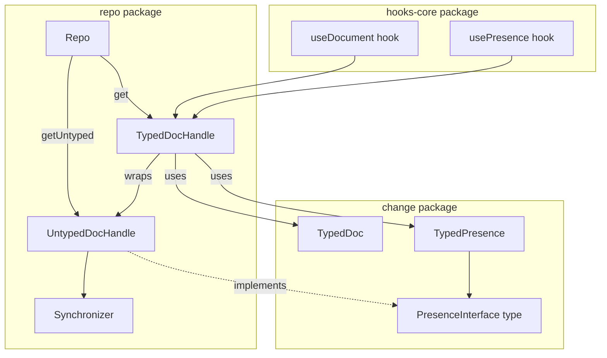

# Plan: Strongly Typed DocHandle from Repo.get

## Overview

This plan refactors the `Repo.get()` API to return strongly typed `TypedDocHandle` instances that provide immediate access to `TypedDoc` and `TypedPresence` without requiring manual wrapping.

## Goals

1. **Type Safety**: `repo.get(docId, docShape, presenceShape)` returns a handle where `.doc` is a `TypedDoc` and `.presence` is a `TypedPresence`
2. **Ergonomic API**: Developers can immediately use `handle.doc.change(draft => { ... })` without wrapping
3. **Optimized Hooks**: React hooks use the typed handle directly instead of creating `TypedDoc` instances on each render
4. **Consistent Architecture**: `TypedDoc` and `TypedPresence` live in `change`, while `TypedDocHandle` lives in `repo` to manage sync state.

## Motivation Example

In `examples/bumper-cars/src/server/game-loop.ts`, the developer currently has to manually wrap the handle's doc in a TypedDoc every time they want to make a change:

```typescript
// Current (verbose, repetitive)
private incrementScore(peerId: PeerID): void {
  const typedDoc = createTypedDoc(ArenaSchema, this.handle.doc)
  typedDoc.change((draft: Draft<typeof ArenaSchema>) => {
    const score = draft.scores.get(peerId)
    if (score) {
      score.bumps.increment(1)
    }
  })
}
```

With the new API:

```typescript
// New (clean, ergonomic)
private incrementScore(peerId: PeerID): void {
  this.handle.doc.change(draft => {
    const score = draft.scores.get(peerId)
    if (score) {
      score.bumps.increment(1)
    }
  })
}
```

## Architecture Changes



## Detailed Changes

### Phase 1: Move PresenceInterface to `change` package

**File: `packages/change/src/presence-interface.ts`** (new)

```typescript
import type { Value } from "loro-crdt";

export type ObjectValue = Record<string, Value>;

export interface PresenceInterface {
  set: (values: ObjectValue) => void;
  get: (key: string) => Value;
  readonly self: ObjectValue;
  readonly all: Record<string, ObjectValue>;
  setRaw: (key: string, value: Value) => void;
  subscribe: (cb: (values: ObjectValue) => void) => () => void;
}
```

### Phase 2: Move TypedPresence to `change` package

**File: `packages/change/src/typed-presence.ts`** (moved from repo)

```typescript
import type { Infer, ValueShape } from "./shape.js";
import { deriveShapePlaceholder, mergeValue } from "./index.js";
import type { PresenceInterface, ObjectValue } from "./presence-interface.js";

export class TypedPresence<S extends ValueShape> {
  private placeholder: Infer<S>;

  constructor(public shape: S, private presence: PresenceInterface) {
    this.placeholder = deriveShapePlaceholder(shape) as Infer<S>;
  }

  get self(): Infer<S> {
    return mergeValue(
      this.shape,
      this.presence.self,
      this.placeholder
    ) as Infer<S>;
  }

  get all(): Record<string, Infer<S>> {
    const result: Record<string, Infer<S>> = {};
    const all = this.presence.all;
    for (const peerId of Object.keys(all)) {
      result[peerId] = mergeValue(
        this.shape,
        all[peerId],
        this.placeholder
      ) as Infer<S>;
    }
    return result;
  }

  set(value: Partial<Infer<S>>) {
    this.presence.set(value as ObjectValue);
  }

  subscribe(
    cb: (state: { self: Infer<S>; all: Record<string, Infer<S>> }) => void
  ): () => void {
    cb({ self: this.self, all: this.all });
    return this.presence.subscribe(() => {
      cb({ self: this.self, all: this.all });
    });
  }
}
```

### Phase 3: Rename DocHandle to UntypedDocHandle in `repo` package

**File: `packages/repo/src/untyped-doc-handle.ts`** (renamed from doc-handle.ts)

Key changes:

- Rename class from `DocHandle` to `UntypedDocHandle`
- Remove the generic `<T extends DocContent>`
- Keep `untypedPresence` as the presence interface
- Remove the `presence<S>(shape)` method
- Implement `PresenceInterface` from `change` package

```typescript
import { getLogger, type Logger } from "@logtape/logtape";
import type { PresenceInterface, ObjectValue } from "@loro-extended/change";
import type { LoroDoc, Value } from "loro-crdt";
import type { Synchronizer } from "./synchronizer.js";
import type { DocId } from "./types.js";

// ... imports

/**
 * An untyped handle to a Loro document.
 * For typed access, use Repo.get() with docShape and presenceShape parameters.
 */
export class UntypedDocHandle {
  // ... existing implementation renamed ...
  public readonly presence: PresenceInterface;
  
  // ...
}
```

### Phase 4: Create TypedDocHandle in `repo` package

**File: `packages/repo/src/typed-doc-handle.ts`** (new)

```typescript
import type {
  DocShape,
  ValueShape,
  Infer,
  Draft,
  DeepReadonly,
} from "@loro-extended/change";
import { TypedDoc, TypedPresence } from "@loro-extended/change";
import { UntypedDocHandle } from "./untyped-doc-handle.js";
import type { ReadyState, ReadinessCheck } from "./types.js";

export class TypedDocHandle<D extends DocShape, P extends ValueShape = any> {
  public readonly docId: string;
  public readonly peerId: string;

  private readonly _doc: TypedDoc<D>;
  private readonly _presence: TypedPresence<P>;

  constructor(
    public readonly untyped: UntypedDocHandle,
    docShape: D,
    presenceShape: P
  ) {
    this.docId = untyped.docId;
    this.peerId = untyped.peerId;
    this._doc = new TypedDoc(docShape, untyped.doc);
    this._presence = new TypedPresence(presenceShape, untyped.presence);
  }

  /**
   * The strongly-typed document.
   * Use `.value` for read access, `.change()` for mutations.
   */
  get doc(): TypedDoc<D> {
    return this._doc;
  }

  /**
   * The strongly-typed presence state.
   */
  get presence(): TypedPresence<P> {
    return this._presence;
  }

  /**
   * Convenience method: Get the current document value.
   */
  get value(): DeepReadonly<Infer<D>> {
    return this._doc.value;
  }

  /**
   * Convenience method: Mutate the document.
   */
  change(fn: (draft: Draft<D>) => void): Infer<D> {
    return this._doc.change(fn);
  }

  // Proxy common sync methods
  get readyStates(): ReadyState[] {
    return this.untyped.readyStates;
  }

  async waitUntilReady(predicate: ReadinessCheck): Promise<TypedDocHandle<D, P>> {
    await this.untyped.waitUntilReady(predicate);
    return this;
  }
  
  async waitForNetwork(): Promise<TypedDocHandle<D, P>> {
    await this.untyped.waitForNetwork();
    return this;
  }
  
  // ... other proxies
}
```

### Phase 5: Update Repo with typed and untyped get methods

**File: `packages/repo/src/repo.ts`**

The `get()` method supports three overloads for maximum flexibility:

1. **Typed with presence**: `get(docId, docShape, presenceShape)` → `TypedDocHandle<D, P>`
2. **Typed without presence**: `get(docId, docShape)` → `TypedDocHandle<D, ValueShape>`
3. **Untyped (backward compatible)**: `get(docId)` → `UntypedDocHandle`

```typescript
import type { DocShape, ValueShape } from "@loro-extended/change";
import { TypedDocHandle } from "./typed-doc-handle.js";
import { UntypedDocHandle } from "./untyped-doc-handle.js";

export class Repo {
  readonly #untypedHandles: Map<DocId, UntypedDocHandle> = new Map();

  // Overload 1: Doc and Presence shapes → TypedDocHandle
  get<D extends DocShape, P extends ValueShape>(
    docId: DocId,
    docShape: D,
    presenceShape: P
  ): TypedDocHandle<D, P>;

  // Overload 2: Doc shape only → TypedDocHandle (with any presence)
  get<D extends DocShape>(
    docId: DocId,
    docShape: D
  ): TypedDocHandle<D, ValueShape>;

  // Overload 3: No shape → UntypedDocHandle (backward compatible)
  get(docId: DocId): UntypedDocHandle;

  // Implementation
  get<D extends DocShape, P extends ValueShape>(
    docId: DocId,
    docShape?: D,
    presenceShape?: P
  ): TypedDocHandle<D, P> | UntypedDocHandle {
    const untypedHandle = this.getUntyped(docId);
    
    // If no docShape provided, return untyped handle (backward compatible)
    if (!docShape) {
      return untypedHandle;
    }

    // Default to empty presence if not provided
    const pShape = presenceShape ?? ({} as unknown as P);

    return new TypedDocHandle(untypedHandle, docShape, pShape);
  }

  getUntyped(docId: DocId): UntypedDocHandle {
    let handle = this.#untypedHandles.get(docId);

    if (!handle) {
      handle = new UntypedDocHandle({
        docId,
        synchronizer: this.#synchronizer,
        logger: this.logger,
      });
      this.#untypedHandles.set(docId, handle);
    }

    return handle;
  }
}
```

This design provides:
- **Backward compatibility**: Existing `repo.get("docId")` calls continue to work
- **Progressive typing**: Users can opt into typed access when they have a schema
- **Explicit untyped access**: `getUntyped()` remains available for advanced use cases

### Phase 6: Update hooks-core to use TypedDocHandle

**File: `packages/hooks-core/src/index.ts`**

Updates `useDocument` to use `repo.get(id, shape)` and return `TypedDocHandle`.

### Phase 7: Update exports

**File: `packages/change/src/index.ts`**
- Export `TypedPresence`, `PresenceInterface`, `ObjectValue`

**File: `packages/repo/src/index.ts`**
- Export `UntypedDocHandle`
- Export `TypedDocHandle`

## Todo List

### Phase 1: Create PresenceInterface in `change` package

1. [x] Create `packages/change/src/presence-interface.ts` with `PresenceInterface` and `ObjectValue` types

### Phase 2: Move TypedPresence to `change` package

2. [x] Move `TypedPresence` from `packages/repo/src/typed-presence.ts` to `packages/change/src/typed-presence.ts`
   - Update imports to use local `PresenceInterface`
   - Update constructor to accept `PresenceInterface` instead of `DocHandle`
3. [x] Update `packages/repo/src/typed-presence.ts` to re-export from change package (backward compatibility)
4. [x] Keep `packages/repo/src/typed-presence.test.ts` (tests the re-export)

### Phase 3: Refactor DocHandle to UntypedDocHandle in `repo` package

5. [x] Create `packages/repo/src/untyped-doc-handle.ts`
   - New class `UntypedDocHandle`
   - No generic type parameter
   - `presence` property (renamed from `untypedPresence`)
   - No `presence<S>(shape)` method
   - Implements `PresenceInterface` from `@loro-extended/change`
6. [x] Update `packages/repo/src/doc-handle.ts` to re-export `UntypedDocHandle` as `DocHandle` (backward compatibility)
7. [x] Create `packages/repo/src/untyped-doc-handle.test.ts`
   - Tests for `UntypedDocHandle`
8. [x] Keep `packages/repo/src/doc-handle.test.ts` (tests the backward-compatible alias)

### Phase 4: Create TypedDocHandle in `repo` package

9. [x] Create `packages/repo/src/typed-doc-handle.ts` with `TypedDocHandle` class
   - Wraps `UntypedDocHandle`
   - Proxies sync methods (`waitUntilReady`, etc.)
   - Exposes typed `doc` and `presence`

### Phase 5: Update Repo with typed and untyped get methods

10. [x] Update `packages/repo/src/repo.ts`
    - Import `TypedDocHandle` and `UntypedDocHandle`
    - Add `get<D, P>(docId, docShape, presenceShape)` method with overloads
    - Add `get<D>(docId, docShape)` overload
    - Keep `get(docId)` returning `UntypedDocHandle` for backward compatibility
    - Add `getUntyped(docId)` as explicit untyped accessor
    - Update internal `#handles` map to `#untypedHandles`
11. [x] Update `packages/repo/src/repo.test.ts`
    - Add tests for new `get()` method with shapes
    - Tests for backward-compatible `get(docId)` returning `UntypedDocHandle`

### Phase 6: Update exports

12. [x] Update `packages/change/src/index.ts`
    - Export `TypedPresence`, `PresenceInterface`, `ObjectValue`
13. [x] Update `packages/repo/src/index.ts`
    - Export `UntypedDocHandle`
    - Export `TypedDocHandle`

### Phase 7: Update hooks-core

14. [x] Update `packages/hooks-core/src/index.ts`
    - Update import from `DocHandle` to `UntypedDocHandle`
    - Update `usePresence` to create `TypedPresence` from `handle.presence`
    - Update `useUntypedPresence` to use `handle.presence`
15. [x] Update `packages/react/src/hooks/use-presence.test.tsx` (tests pass)

### Phase 8: Update adapters

16. [x] Update `adapters/websocket/src/__tests__/e2e.test.ts`
    - Replace `handle.untypedPresence` with `handle.presence`

### Phase 9: Update examples (optional, for future)

17. [ ] Update `examples/todo-sse` to use new API (optional)
18. [ ] Update `examples/bumper-cars/src/server/game-loop.ts` (optional)
    - Remove manual `createTypedDoc()` wrapping
    - Use `handle.doc.change()` directly
19. [ ] Update any other examples that use the old API (optional)
