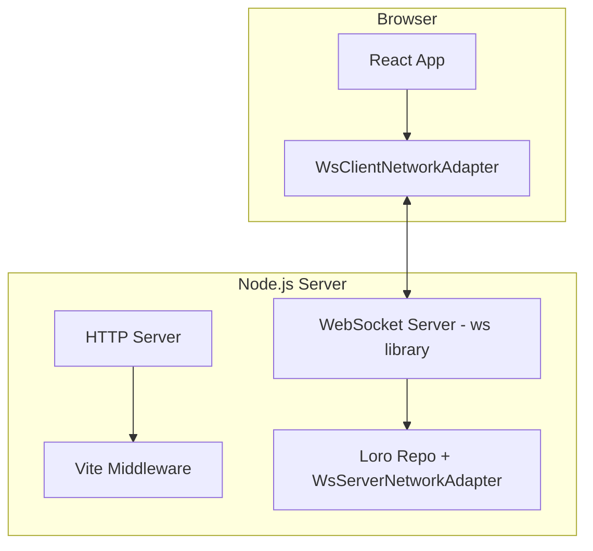

# Plan: todo-vite Example App

## Overview

Create a new example app `examples/todo-vite` that demonstrates loro-extended with:
- **Node.js** server (instead of Bun)
- **Vite** in middleware mode for development
- **React** frontend (same as todo-minimal)
- **WebSocket** sync using the `ws` library

This provides an alternative to the Bun-based `todo-minimal` for users who prefer the Node.js ecosystem.

## Architecture



## Key Differences from todo-minimal

| Aspect | todo-minimal | todo-vite |
|--------|--------------|-----------|
| Runtime | Bun | Node.js |
| Bundler | Bun.build | Vite |
| WebSocket | Bun.serve websocket | ws library |
| Dev experience | Manual restart | Vite HMR |
| Server file | TypeScript direct | TypeScript via tsx |

## File Structure

```
examples/todo-vite/
├── package.json
├── README.md
├── tsconfig.json
├── vite.config.ts
├── index.html
└── src/
    ├── server.ts      # Node.js + Vite middleware + ws
    ├── app.tsx        # React app - same as todo-minimal
    └── styles.css     # Styles - same as todo-minimal
```

## Implementation Details

### Server Architecture

The server will use Vite's `createServer` in middleware mode with a parent HTTP server, allowing us to:
1. Handle WebSocket upgrades on `/ws` path
2. Serve Vite-processed frontend assets on all other paths

```typescript
// Conceptual structure
import http from 'node:http'
import { createServer as createViteServer } from 'vite'
import { WebSocketServer } from 'ws'
import { WsServerNetworkAdapter, wrapWsSocket } from '@loro-extended/adapter-websocket/server'
import { Repo } from '@loro-extended/repo'

// 1. Create HTTP server
const httpServer = http.createServer()

// 2. Create Vite dev server in middleware mode
const vite = await createViteServer({
  server: { middlewareMode: { server: httpServer } }
})

// 3. Use Vite middleware for HTTP requests
httpServer.on('request', vite.middlewares)

// 4. Create WebSocket server attached to HTTP server
const wss = new WebSocketServer({ server: httpServer, path: '/ws' })

// 5. Set up loro-extended
const wsAdapter = new WsServerNetworkAdapter()
new Repo({ adapters: [wsAdapter] })

wss.on('connection', (ws) => {
  wsAdapter.handleConnection({ socket: wrapWsSocket(ws) }).start()
})

httpServer.listen(5173)
```

### Dependencies

```json
{
  "dependencies": {
    "@loro-extended/adapter-websocket": "workspace:^",
    "@loro-extended/react": "workspace:^",
    "@loro-extended/repo": "workspace:^",
    "react": "19.1.1",
    "react-dom": "19.1.1",
    "ws": "^8.18.0"
  },
  "devDependencies": {
    "@types/node": "^22.15.29",
    "@types/react": "19.1.8",
    "@types/react-dom": "19.1.6",
    "@types/ws": "^8.5.13",
    "@vitejs/plugin-react": "^4.x",
    "tsx": "^4.x",
    "typescript": "~5.8.3",
    "vite": "^6.x"
  }
}
```

### Scripts

```json
{
  "scripts": {
    "dev": "tsx src/server.ts"
  }
}
```

## Todo List

- [ ] Create `examples/todo-vite/package.json` with Node.js + Vite dependencies
- [ ] Create `examples/todo-vite/tsconfig.json` for TypeScript configuration
- [ ] Create `examples/todo-vite/vite.config.ts` with React plugin
- [ ] Create `examples/todo-vite/index.html` - entry point for Vite
- [ ] Create `examples/todo-vite/src/server.ts` - Node.js server with Vite middleware and ws
- [ ] Copy `examples/todo-vite/src/app.tsx` from todo-minimal - React app unchanged
- [ ] Copy `examples/todo-vite/src/styles.css` from todo-minimal - styles unchanged
- [ ] Create `examples/todo-vite/README.md` documenting the Node.js + Vite approach
- [ ] Test the example works with `pnpm install && pnpm dev`

## Notes

- The [`wrapWsSocket`](adapters/websocket/src/server-adapter.ts:211) function already exists in the websocket adapter for wrapping the `ws` library's WebSocket
- The frontend code ([`app.tsx`](examples/todo-minimal/src/app.tsx:1)) can be reused unchanged since it only depends on the client adapter
- Vite provides HMR for the frontend, improving developer experience over the Bun example
