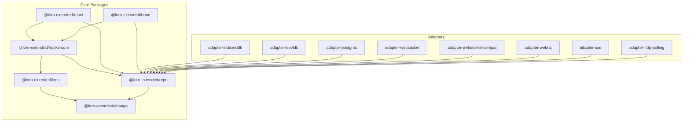

# Turborepo Transition Plan

## Background

The loro-extended monorepo contains 14 packages across 4 workspace directories (`packages/`, `adapters/`, `examples/`, `tools/`). Currently, builds are orchestrated via `pnpm -r build` which runs `tsup` in every package regardless of whether source code has changed. Similarly, `pnpm -r --parallel verify` runs verification in all packages without ensuring dependencies are built first.

### Current Dependency Graph



## Problem Statement

1. **Wasteful rebuilds**: `pnpm -w build` always rebuilds all packages, even when only one package's source has changed
2. **Missing dependency builds**: Running `pnpm verify` on a single package does not ensure its workspace dependencies are built first, leading to potential type errors or test failures

## Success Criteria

1. Running `pnpm build` only rebuilds packages where source code (or dependencies) have changed
2. Running `pnpm verify` (or `pnpm --filter <pkg> verify`) automatically builds all workspace dependencies before running verification
3. Existing package-level scripts (`build`, `verify`) continue to work unchanged
4. CI/local development workflows remain compatible

## Gap Analysis

| Current State | Desired State |
|--------------|---------------|
| `pnpm -r build` rebuilds all 14 packages | Turborepo skips unchanged packages via content hashing |
| `pnpm --filter <pkg> verify` may fail if deps not built | `turbo run verify --filter=<pkg>` builds deps first via `dependsOn: ["^build"]` |
| No build caching | Local cache in `.turbo/`, optional remote cache |
| Sequential or parallel without dependency awareness | Turborepo parallelizes while respecting dependency order |

## Transitive Effect Analysis

### Build Task Changes
- **Direct**: Root `package.json` scripts change from `pnpm -r build` to `turbo run build`
- **Transitive**: All packages benefit from caching; no package-level changes needed

### Verify Task Changes
- **Direct**: Root `package.json` scripts change from `pnpm -r --parallel verify` to `turbo run verify`
- **Transitive**: When verifying a leaf package (e.g., `@loro-extended/react`), Turborepo will:
  1. Build `change` → `lens` → `repo` → `hooks-core` (in dependency order)
  2. Then run verify on `react`
- **No changes to `@halecraft/verify`**: The existing verify.config.ts files remain unchanged; Turborepo orchestrates at the task level, not within verify

### CI Impact
- CI scripts using `pnpm build` or `pnpm verify` will automatically use Turborepo
- First CI run will be similar speed (cache miss); subsequent runs benefit from caching
- Optional: Enable Vercel Remote Cache for cross-CI-run caching

---

## Phases and Tasks

### Phase 1: Install and Configure Turborepo ✅

- [x] ✅ Install turbo as a root dev dependency: `pnpm add -D -w turbo@2.8.3`
- [x] ✅ Create `turbo.json` at repository root with build and verify task definitions
- [x] ✅ Add `.turbo` directory to `.gitignore`
- [x] ✅ Add `packageManager` field to root `package.json` (required by Turborepo)

### Phase 2: Update Root Scripts ✅

- [x] ✅ Update root `package.json` to use `turbo run` for build and verify commands
- [x] ✅ Preserve `build:all` as a force-rebuild option using `turbo run build --force`

### Phase 3: Validation Testing ✅

- [x] ✅ Test incremental build: ran `pnpm build`, verified packages build in dependency order
- [x] ✅ Test dependency ordering: ran `pnpm turbo run verify --filter=@loro-extended/react`, verified deps (change, lens, repo, hooks-core) build first
- [x] ✅ Test cache hit: ran `pnpm build` twice, verified "cache hit, replaying logs" on second run
- [ ] 🔴 Test full rebuild: run `pnpm build:all`, verify all packages rebuild (skipped - pre-existing build error in adapter-websocket)

### Phase 4: Documentation ✅

- [x] ✅ Update `AGENTS.md` to reflect new turbo-based commands
- [ ] 🔴 Add brief Turborepo section to root README if one exists (no root README found)

---

## Configuration Details

### turbo.json

```json
{
  "$schema": "https://turbo.build/schema.json",
  "tasks": {
    "build": {
      "dependsOn": ["^build"],
      "inputs": [
        "src/**",
        "tsconfig.json",
        "tsup.config.ts",
        "package.json"
      ],
      "outputs": ["dist/**"]
    },
    "verify": {
      "dependsOn": ["^build"],
      "inputs": [
        "src/**",
        "*.config.ts",
        "tsconfig.json",
        "package.json"
      ],
      "outputs": [],
      "cache": false
    }
  }
}
```

**Key decisions:**
- `verify` has `cache: false` because tests should run fresh (side effects, timing, etc.)
- `inputs` for build includes config files that affect output
- `outputs` for build is `dist/**` which matches tsup output

### Root package.json scripts

```json
{
  "scripts": {
    "build": "turbo run build",
    "build:all": "turbo run build --force",
    "verify": "turbo run verify"
  }
}
```

---

## Unit and Integration Tests

No new automated tests are required for this infrastructure change. Validation is performed manually in Phase 3 by:

1. **Incremental build test**: Modify a leaf package, observe only that package rebuilds
2. **Dependency chain test**: Modify `change`, observe `lens`, `repo`, `hooks-core`, `react`, `hono`, and all adapters rebuild
3. **Verify dependency test**: Run verify on `react`, observe build tasks run for dependencies first
4. **Cache test**: Run build twice, observe cache hits on second run

---

## Changeset

A changeset is **not required** for this change because:
- Turborepo is a development/build tool, not a published package feature
- No package versions or APIs are affected
- This is internal infrastructure improvement

---

## Documentation Updates

### AGENTS.md Updates

Add note about Turborepo caching behavior:

```markdown
- Builds are cached by Turborepo. To force a full rebuild, use `pnpm build:all` or `turbo run build --force`.
- Running `pnpm verify` on a single package automatically builds its dependencies first.
```

### README.md

If a root README exists, add a brief "Build System" section mentioning Turborepo for incremental builds.
