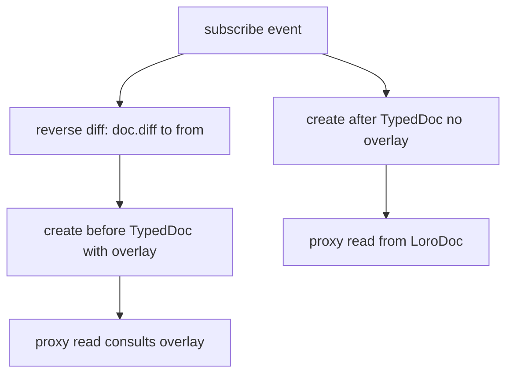

## TypedDoc Diff Overlay Plan

### Background

TypedDoc provides schema-aware proxies and lazy lookup over a Loro document. We want to expose before/after comparisons in subscribe callbacks without forking or checkout churn. Recent exploration shows reverse diffs (`doc.diff(to, from)`) contain the old values for counters and map keys, and can be applied lazily without mutating document state.

Relevant code areas:

- [`packages/change/src/typed-doc.ts`](packages/change/src/typed-doc.ts)
- [`packages/change/src/typed-refs/doc-ref-internals.ts`](packages/change/src/typed-refs/doc-ref-internals.ts)
- [`packages/change/src/typed-refs/struct-ref-internals.ts`](packages/change/src/typed-refs/struct-ref-internals.ts)
- [`packages/change/src/typed-refs/counter-ref-internals.ts`](packages/change/src/typed-refs/counter-ref-internals.ts)

### Problem Statement

We need two TypedDoc instances (`before`, `after`) that share the same underlying LoroDoc but resolve values differently when a reverse diff overlay is present. The overlay must integrate with the Ref proxy system while preserving schema awareness and lazy evaluation. Target container types: counters, map/struct value shapes, list, and text (tree later).

### Success Criteria

- A TypedDoc can be initialized with an optional overlay derived from `doc.diff(to, from)`.
- `before` TypedDoc resolves values using the overlay, while `after` resolves current values from the same LoroDoc.
- Lazy access is preserved: no full state materialization on overlay creation.
- Counters, map/struct value shapes, list, and text are supported; tree is deferred.
- Tests validate before/after comparisons without checkout or fork.

### Gap

The Ref proxy system reads values directly from containers and has no awareness of container IDs or overlay diffs. There is no current mechanism to pass an overlay through `TypedRefParams` or to transform read paths per container type.

### Proposed Overlay Data Format

Use the raw reverse diff as the overlay (no transformation step):

- Overlay type: `Map<ContainerID, Diff>`
- Source: `new Map(doc.diff(batch.to, batch.from, false))`

This avoids transformation steps and keeps per-container logic within ref internals. List/text will be read-only overlay transforms initially.

### High-Level Flow (Mermaid)

### Plan

#### Phase 1 — Overlay plumbing in TypedDoc (🔴)

- 🔴 Add overlay support to TypedDoc initialization parameters in [`packages/change/src/typed-doc.ts`](packages/change/src/typed-doc.ts).
- 🔴 Extend `TypedRefParams` and `BaseRefInternals` to carry optional overlay map (and keep it read-only).
- 🔴 Update [`DocRefInternals`](packages/change/src/typed-refs/doc-ref-internals.ts) to pass overlay through `getChildTypedRefParams`.

#### Phase 2 — Read-path transformations by Ref type (🔴)

- 🔴 Counter: apply reverse diff increment in [`CounterRefInternals.getValue()`](packages/change/src/typed-refs/counter-ref-internals.ts).
- 🔴 Struct/map value shapes: on `container.get(key)` path in [`StructRefInternals.getOrCreateRef()`](packages/change/src/typed-refs/struct-ref-internals.ts), return old value when `MapDiff.updated` contains key.
- 🔴 List: define a minimal, read-only reverse-delta reader for list value access and integrate in list ref internals.
- 🔴 Text: define a minimal, read-only reverse-delta reader for text value access and integrate in text ref internals.
- 🔴 Add guardrails when overlay is present but unsupported for a ref type (return after value + dev-only warning).

#### Phase 3 — Overlay creation helpers (🔴)

- 🔴 Add a small helper for creating overlay maps from `LoroEventBatch` (likely colocated with TypedDoc or in a new helper module) and expose it from package index.
- 🔴 Ensure overlay map is immutable from consumer perspective to prevent mutation surprises.
- 🔴 Ensure overlay is immutable from consumer perspective (type-level and runtime defensive copy if needed).

#### Phase 4 — Tests (🔴)

- 🔴 Add targeted tests verifying before/after comparisons for counters, map/struct value shapes, list, and text using a reverse diff overlay.
- 🔴 Add integration test using subscribe callback that constructs `before` and `after` TypedDocs and asserts typed access is correct without checkout.
- 🔴 Reuse existing test helpers and minimal fixtures (e.g., patterns from [`packages/change/src/subscription-state.test.ts`](packages/change/src/subscription-state.test.ts)).

#### Phase 5 — Documentation (🔴)

- 🔴 Add usage notes for overlay-enabled TypedDocs in package documentation (likely [`packages/change/README.md`](packages/change/README.md) if present, or create a short section in existing docs).
- 🔴 Update technical notes if there is a suitable doc (if a `TECHNICAL.md` exists, add overlay behavior and limits).

### Tests

- Unit tests per ref type for overlay read paths (counter, map/struct, list, text) with list/text read-only expectations.
- Integration test for subscribe callback with `before`/`after` TypedDocs sharing a LoroDoc.
- No performance assertions; focus on correctness and non-mutating behavior.

### Transitive Effects Analysis

- Changes to `TypedRefParams` and `BaseRefInternals` will affect all TypedRef implementations. Ensure all constructors and helpers pass through the new overlay param to avoid runtime undefined behavior.
- Proxy read logic changes in map/struct, list, and text refs could impact placeholder behavior and batching semantics. Verify overlay logic only affects read paths and does not modify container state.
- If overlay logic uses container IDs, confirm all relevant container types expose `id` consistently; any mismatch could break downstream ref behavior.
- Ref read paths with batched mutation branches must apply overlay consistently to avoid divergent results across read contexts.

### Changeset

- Create a changeset for `@loro-extended/change` if the public TypedDoc API gains new params or helper exports.

### Documentation Updates

- Update relevant README/technical docs if they exist to describe the overlay feature, its limitations (tree deferred), and recommended usage in subscribe callbacks.

### Open Questions Resolved

- Overlay should support counters, map/struct value shapes, list, and text (tree later).
- Use raw reverse diff format directly; no transformation step required.
