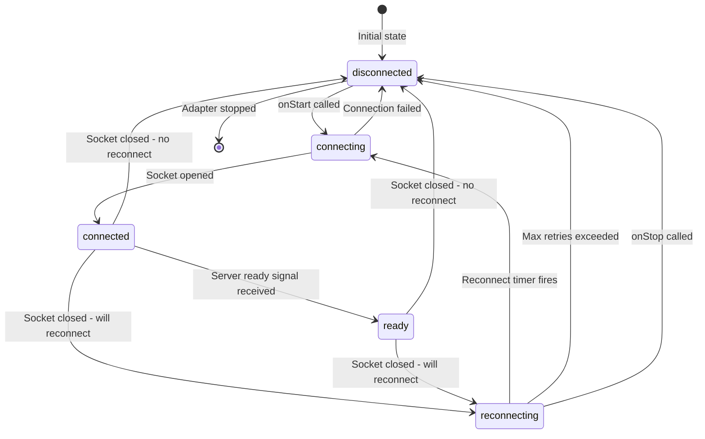

# WebSocket Client State Machine Refactor

**Status: ✅ Completed**

## Background

The `WsClientNetworkAdapter` in `adapters/websocket/src/client.ts` manages WebSocket connections with automatic reconnection. A flaky test revealed fundamental issues with how connection state is managed and observed.

### Current State Management

The adapter currently tracks connection state through three separate, potentially inconsistent properties:

1. **`connectionState`** - A string enum: `"disconnected" | "connecting" | "connected" | "reconnecting"`
2. **`serverReady`** - A boolean indicating whether the server's "ready" signal has been received
3. **`isConnected`** - A getter that checks `socket?.readyState === WebSocket.OPEN`

These three properties can be in inconsistent states:
- `connectionState` can be `"connected"` while `serverReady` is `false` (waiting for ready signal)
- `isConnected` can be `false` while `connectionState` is `"reconnecting"` (socket closed, timer pending)
- `serverReady` can be `true` while `isConnected` is `false` (brief window during disconnect)

### The Flaky Test Problem

The test in `ready-signal.test.ts` tried to verify that `serverReady` resets to `false` on disconnect. However:

1. In `handleClose()`, `setConnectionState("disconnected")` is immediately followed by `scheduleReconnect()`
2. `scheduleReconnect()` synchronously calls `setConnectionState("reconnecting")`
3. The "disconnected" state exists for **zero event loop ticks**
4. With fast reconnection (100ms baseDelay in test), the entire disconnect→reconnect cycle can complete before external observers react

## Problem Statement

Application code cannot reliably observe or react to connection state changes because:

1. State transitions happen synchronously within the same call stack
2. Multiple properties must be checked together to understand true connection status
3. No distinction between intentional disconnect (`onStop()`) and connection loss
4. No lifecycle events that fire at well-defined points

## Success Criteria

1. **Single source of truth**: One unified state machine that represents all connection states
2. **Observable transitions**: All state changes are observable via subscription, with guaranteed delivery before the next state
3. **Semantic states**: States that reflect the actual connection lifecycle (including "ready" vs "connected but not ready")
4. **Lifecycle events**: Callbacks that fire at well-defined points for common use cases
5. **Backward compatibility**: Existing `connectionState` and `isConnected` APIs continue to work
6. **Testability**: State transitions can be reliably tested without race conditions

## Gap Analysis

| Current | Target |
|---------|--------|
| 3 separate state properties | 1 unified state machine |
| Synchronous state transitions | Async-observable transitions |
| No disconnect reason | Disconnect reason included in events |
| `subscribe()` may miss states | All transitions guaranteed observable |
| No lifecycle events | `onDisconnect`, `onReconnecting`, `onReconnected`, `onReady` callbacks |

## Phases and Tasks

### Phase 1: Define Unified State Machine 🔴

- 🔴 Define `WsClientState` type with all possible states:
  ```typescript
  type WsClientState =
    | { status: "disconnected"; reason?: DisconnectReason }
    | { status: "connecting"; attempt: number }
    | { status: "connected" }  // Socket open, waiting for ready signal
    | { status: "ready" }      // Socket open AND server ready signal received
    | { status: "reconnecting"; attempt: number; nextAttemptMs: number }
  ```
- 🔴 Define `DisconnectReason` type:
  ```typescript
  type DisconnectReason =
    | { type: "intentional" }
    | { type: "error"; error: Error }
    | { type: "closed"; code: number; reason: string }
    | { type: "max-retries-exceeded" }
  ```
- 🔴 Define `WsClientStateTransition` type for observable transitions:
  ```typescript
  type WsClientStateTransition = {
    from: WsClientState
    to: WsClientState
    timestamp: number
  }
  ```

### Phase 2: Implement State Machine Core 🔴

- 🔴 Create `WsClientStateMachine` class in new file `adapters/websocket/src/client-state-machine.ts`
- 🔴 Implement state transition validation (only allow valid transitions)
- 🔴 Implement subscription mechanism with guaranteed delivery:
  - Transitions are queued and delivered asynchronously (via `queueMicrotask`)
  - Subscribers receive all transitions, even if multiple happen in same tick
- 🔴 Add `getState()` method for synchronous state access
- 🔴 Add `waitForState()` method for async state waiting (useful for tests)

### Phase 3: Integrate State Machine into Client Adapter 🔴

- 🔴 Replace `connectionState`, `serverReady`, `isConnecting` with state machine
- 🔴 Update `connect()` to use state machine transitions
- 🔴 Update `handleClose()` to use state machine transitions
- 🔴 Update `handleServerReady()` to use state machine transitions
- 🔴 Update `scheduleReconnect()` to use state machine transitions
- 🔴 Maintain backward-compatible `connectionState` getter (derived from state machine)
- 🔴 Maintain backward-compatible `isConnected` getter (derived from state machine)

### Phase 4: Add Lifecycle Events 🔴

- 🔴 Add `WsClientLifecycleEvents` interface:
  ```typescript
  interface WsClientLifecycleEvents {
    onStateChange?: (transition: WsClientStateTransition) => void
    onDisconnect?: (reason: DisconnectReason) => void
    onReconnecting?: (attempt: number, nextAttemptMs: number) => void
    onReconnected?: () => void
    onReady?: () => void
  }
  ```
- 🔴 Add lifecycle events to `WsClientOptions`
- 🔴 Fire lifecycle events from state machine transitions
- 🔴 Document lifecycle event ordering guarantees

### Phase 5: Update Tests 🔴

- 🔴 Update `ready-signal.test.ts` to use new state machine APIs
- 🔴 Add tests for state transition validation
- 🔴 Add tests for subscription delivery guarantees
- 🔴 Add tests for lifecycle events
- 🔴 Add tests for disconnect reasons
- 🔴 Remove workarounds from existing tests that were compensating for race conditions

### Phase 6: Documentation and Changeset 🔴

- 🔴 Update `adapters/websocket/README.md` with new state machine documentation
- 🔴 Add migration guide for users of `connectionState` subscription
- 🔴 Create changeset describing the changes
- 🔴 Update JSDoc comments on all public APIs

## State Transition Diagram



## Unit and Integration Tests

### State Machine Unit Tests (`client-state-machine.test.ts`)

1. **Valid transitions**: Test that valid state transitions are allowed
2. **Invalid transitions**: Test that invalid transitions throw errors
3. **Subscription delivery**: Test that subscribers receive all transitions in order
4. **Async delivery**: Test that transitions are delivered via microtask queue
5. **Multiple subscribers**: Test that multiple subscribers all receive transitions
6. **Unsubscribe**: Test that unsubscribed listeners don't receive transitions

### Client Adapter Integration Tests (`ready-signal.test.ts` updates)

1. **State observation**: Test that `waitForState()` can reliably observe all states
2. **Disconnect reason**: Test that disconnect reason is correctly set for various scenarios
3. **Lifecycle events**: Test that lifecycle events fire in correct order
4. **Backward compatibility**: Test that `connectionState` and `isConnected` still work

## Transitive Effect Analysis

### Direct Dependencies

| Module | Impact |
|--------|--------|
| `WsClientNetworkAdapter` | Major refactor - internal state management |
| `ready-signal.test.ts` | Update to use new APIs |
| `e2e.test.ts` | May need updates if using `isConnected` |
| `hub-spoke-sync.test.ts` | May need updates if using `isConnected` |

### Transitive Dependencies

| Module | Depends On | Impact |
|--------|------------|--------|
| Application code using `subscribe()` | `WsClientNetworkAdapter` | **Breaking**: Callback signature changes from `(state: ConnectionState) => void` to `(transition: WsClientStateTransition) => void` |
| Application code using `connectionState` | `WsClientNetworkAdapter` | **Non-breaking**: Getter still works, returns derived value |
| Application code using `isConnected` | `WsClientNetworkAdapter` | **Non-breaking**: Getter still works, returns derived value |

### Migration Path for Breaking Changes

The `subscribe()` method signature change is breaking. Options:

1. **Option A (Recommended)**: Add new `subscribeToTransitions()` method, deprecate `subscribe()`
2. **Option B**: Version bump with migration guide

We will use **Option A** to maintain backward compatibility:
- `subscribe(listener)` - Deprecated, calls listener with derived `ConnectionState`
- `subscribeToTransitions(listener)` - New, calls listener with full `WsClientStateTransition`

## Changeset

A minor version bump is appropriate since:
- New features are added (state machine, lifecycle events)
- Existing APIs remain backward compatible
- `subscribe()` is deprecated but still works

## README Updates

The `adapters/websocket/README.md` should be updated to document:
- New state machine and state types
- Lifecycle events and when they fire
- Migration from `subscribe()` to `subscribeToTransitions()`
- Examples of common patterns (showing reconnection UI, handling disconnect)
